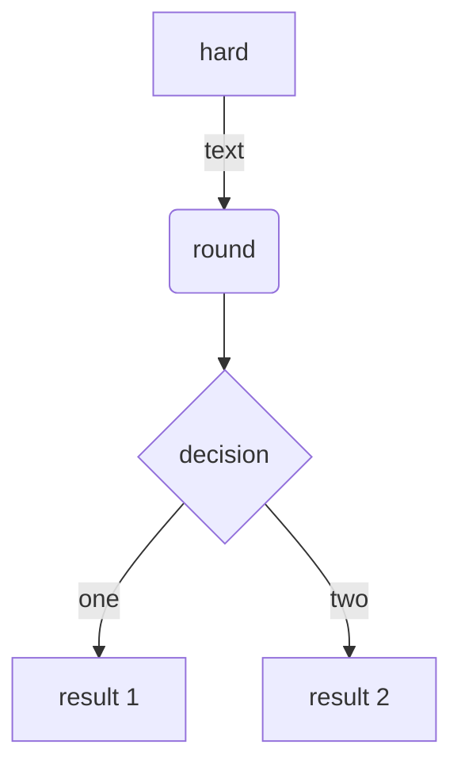
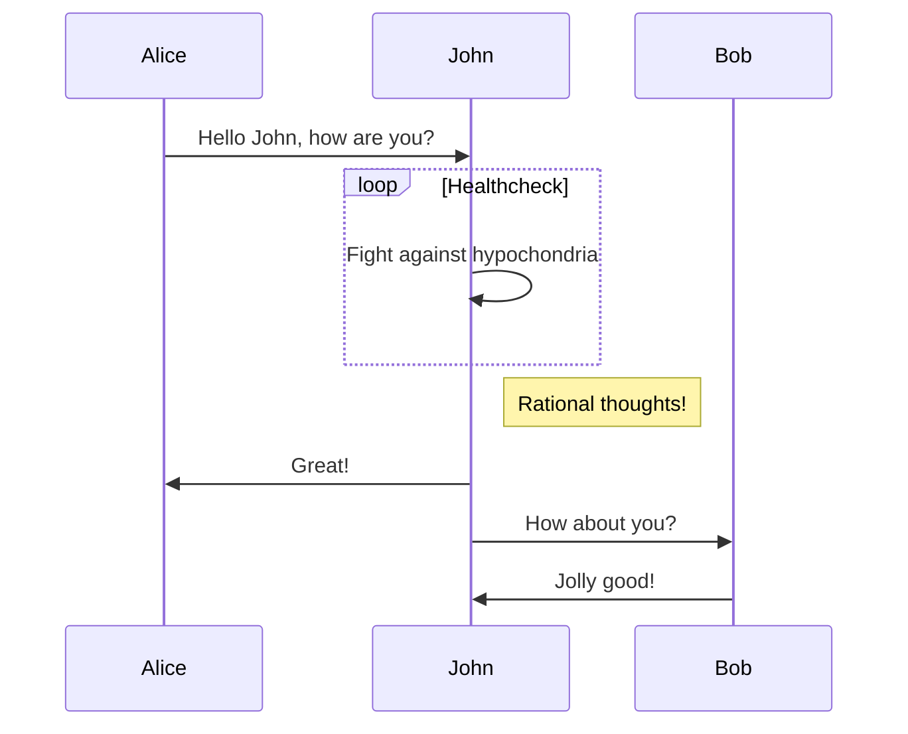
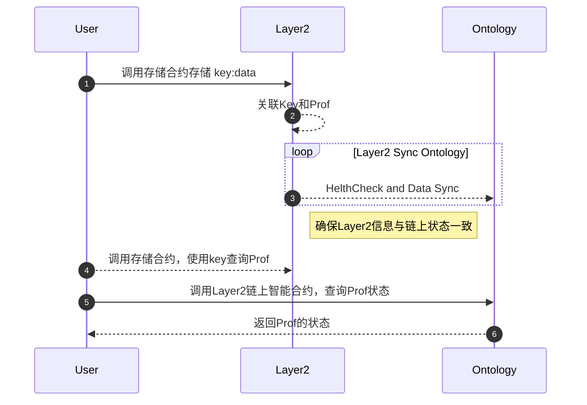
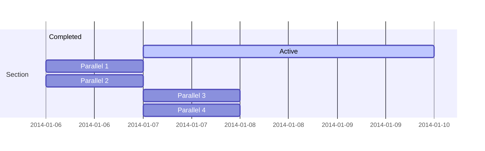
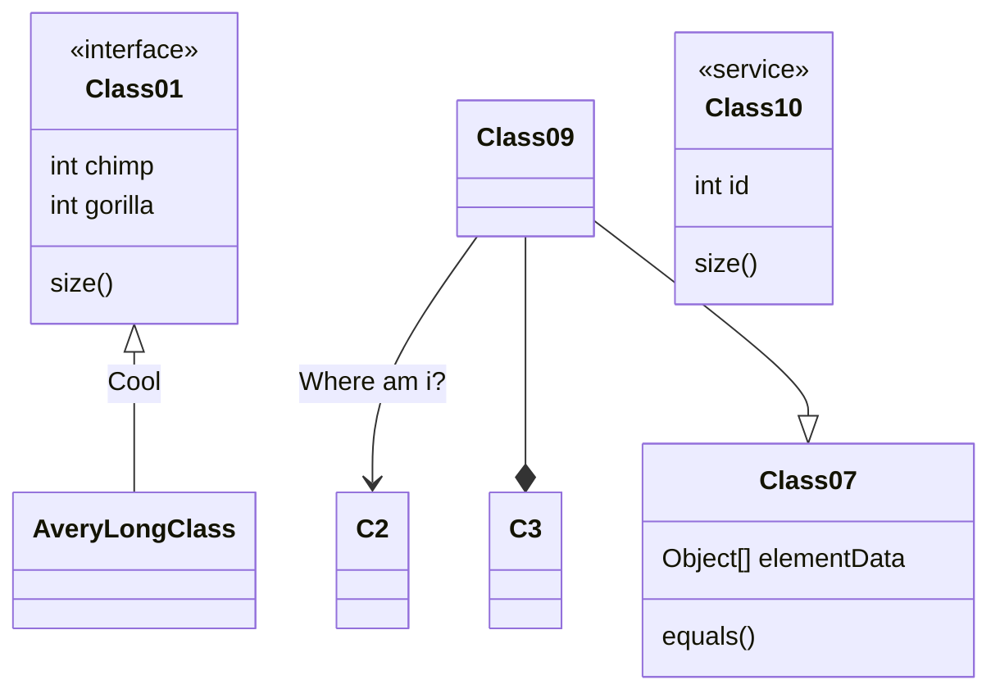
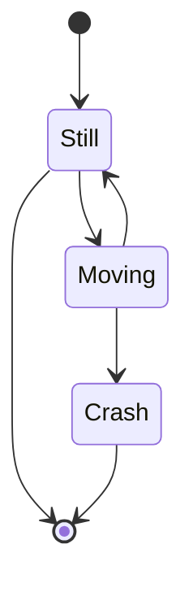
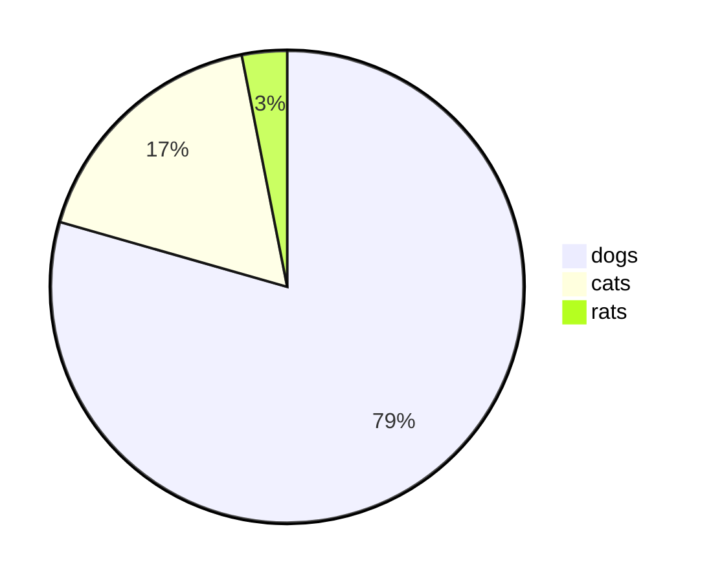

# MarkDown基础语法

## 一、标题

一个#是一级标题，二个##是二级标题，最多支持六级标题

编辑示例：
```
# 这是一级标题
## 这是二级标题
### 这是三级标题
#### 这是四级标题
##### 这是五级标题
###### 这是六级标题
```

效果：
# 这是一级标题
## 这是二级标题
### 这是三级标题
#### 这是四级标题
##### 这是五级标题
###### 这是六级标题

## 二、字体

将需要加粗的文字放在四个*之间

将需要徐体的文字放在两个*之间

将需要加粗和徐体的文字放在六个*之间

将需要加删除线的文字放在四个~之间

编辑示例：
```
**这是加粗的文字**
*这是倾斜的文字*
***这是斜体加粗的文字***
~~这是加删除线的文字~~
```

效果：

**这是加粗的文字**

*这是倾斜的文字*

***这是斜体加粗的文字***

~~这是加删除线的文字~~

## 三、引用

在引用的文字前加>即可，可以多个

编辑示例：
```
>这是引用的内容
>>这是引用的内容
>>>>>>>>>>这是引用的内容
```

效果：
>这是引用的内容
>>这是引用的内容
>>>>>>>>>>这是引用的内容

## 四、分割线

三个或者三个以上的-或者*都可以

编辑示例：
```
---
--------
***
************
```

效果：

---
--------
***
************

## 五、图片

### 无格式图片显示

语法：
```


图片alt就是显示在图片下面的文字，相当于对图片内容的解释。alt可加可不加
图片title是图片的标题，当鼠标移到图片上时显示的内容。title可加可不加
```

编辑示例：
```

```
效果：


### 指定格式的图片显示

语法：
```
<div align=center></div>
按照html格式的语法来指定格式
```

编辑示例：
```
<div align=center></div>
```

效果：

<div align=center></div>

## 六、超链接

语法：
```
[超链接名](超链接地址 "超链接title") title可加可不加
```

编辑示例：
```
[简书](http://jianshu.com)
[百度](http://baidu.com)
```

效果：

[简书](http://jianshu.com)

[百度](http://baidu.com)

## 七、列表

### 无序列表

语法：
无序列表用 - + * 任何一种都可以

编辑示例：
```
- 列表内容
+ 列表内容
* 列表内容

注意：- + * 跟内容之间都要有一个空格
```

效果：
- 列表内容
+ 列表内容
* 列表内容

### 有序列表

语法：
数字加点

编辑示例
```
1. 列表内容
2. 列表内容
3. 列表内容

注意：序号跟内容之间要有空格
```

效果：
1. 列表内容
2. 列表内容
3. 列表内容

### 嵌套列表

上一级和下一级之间三个空格即可

编辑示例：
```
+ 一级无序列表内容
   + 二级无序列表内容
   + 二级无序列表内容
   + 二级无序列表内容
+ 一级无序列表内容
   1. 二级有序列表内容
   2. 二级有序列表内容
   3. 二级有序列表内容

1. 一级有序列表内容
   + 二级无序列表内容
   + 二级无序列表内容
   + 二级无序列表内容
2. 一级有序列表内容
   1. 二级有序列表内容
   2. 二级有序列表内容
   3. 二级有序列表内容
```

效果：

+ 一级无序列表内容
   + 二级无序列表内容
   + 二级无序列表内容
   + 二级无序列表内容
+ 一级无序列表内容
   1. 二级有序列表内容
   2. 二级有序列表内容
   3. 二级有序列表内容

1. 一级有序列表内容
   + 二级无序列表内容
   + 二级无序列表内容
   + 二级无序列表内容
2. 一级有序列表内容
   1. 二级有序列表内容
   2. 二级有序列表内容
   3. 二级有序列表内容

## 八、表格

语法：
```
表头|表头|表头
---|:--:|---:
内容|内容|内容
内容|内容|内容

第二行分割表头和内容。
- 有一个就行，为了对齐，多加了几个
文字默认居左
-两边加：表示文字居中
-右边加：表示文字居右
注：原生的语法两边都要用 | 包起来。此处省略
```

编辑示例：
```
姓名|技能|排行
--|:--:|--:
刘备|哭|大哥
关羽|打|二哥
张飞|骂|三弟
```

效果：
|姓名|技能|排行|
|--|:--:|--:|
|刘备|哭|大哥|
|关羽|打|二哥|
|张飞|骂|三弟|

## 九、代码

### 单行代码

代码用一个反引号包起来

语法：
```
 `代码内容`
```

编辑示例：
```
`create database hero;`
```

效果：

`create database hero;`

### 代码块

用三个反引号包起来，且两边的反引号需要单独占一行

语法：
```
(```)
    代码
    代码
    代码
(```)
小括号是编辑时没有的，此处是为转义需要
```

编辑示例：
```
(```)
    func hello(){
         fmt.printf("hello")
    }
(```)
```

效果：

```
    func hello(){
         fmt.printf("hello")
    }
```

## 十、流程图

mermaid编辑示例：
```
graph TD
    A[hard] --> |text| B(round)
    B --> C{decision}
    C --> |one| D[result 1]
    C --> |two| E[result 2]
```

效果：



## 十一、时序图

mermaid编辑示例:
```
sequenceDiagram
    Alice->>John: Hello John, how are you?
    loop Healthcheck
        John->>John: Fight against hypochondria
    end
    Note Right of John: Rational thoughts!
    John->>Alice: Great!
    John->>Bob: How about you?
    Bob->>John: Jolly good!
```

效果:




## 十二、甘特图

mermmaid编辑示例:
```
gantt
section Section
Complated : dene, des1, 2014-01-06, 2014-01-08
Active : active, des2, 2014-01-07, 3d
Parallel 1 : des3, after des1, 1d
Parallel 2 : des4, after des1, 1d
Parallel 3 : des5, after des3, 1d
Parallel 4 : des6, after des4, 1d
```

效果:


## 十三、类图
mermaid编辑示例:
```
classDiagram
Class01 <| -- AveryLongClass : Cool
<<interface>> Class01
Class09 --> C2 : Where am i?
Class09 --> *C3
Class09 --|> Class07
Class07 : equals()
Class07 : Object[] elementData
Class01 : size()
Class01 : int chimp
Class01 : int gorilla
class Class10 {
    <<service>>
    int id
    size()
}
```

效果:


## 十四、状态图
mermaid编辑示例:
```
stateDiagram
[*] --> Still
Still --> [*]
Still --> Moving
Moving --> Still
Moving --> Crash
Crash --> [*]
```

效果:


## 十五、饼图
mermaid编辑示例:
```
pie
    "dogs": 386
    "cats": 85
    "rats": 15
```

效果:


关于markdown绘制时序图、流程图的详细教程：

https://blog.csdn.net/suoxd123/article/details/84992282

https://www.cnblogs.com/yueshangzuo/p/7992145.html

[mermaid用户手册](https://mermaid-js.github.io/mermaid/#/)

## 十一、思维导图

## 页内跳转

+ 定义锚点 [xxxx](#xxxx)
+ 锚点目标

## markdown学习的思维导图

[markdown学习思维导图](https://mm.edrawsoft.cn/template/26379)


