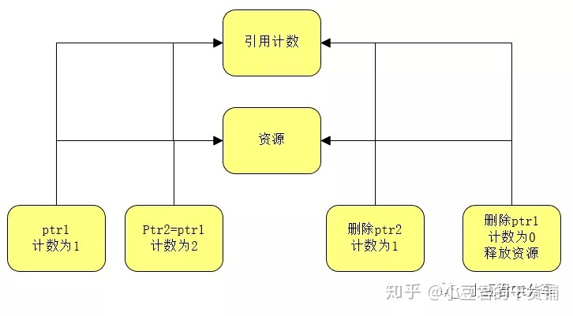

# C++智能指针

## C++智能指针的引入

传统C++指针的生命周期维护很困难，当用户在堆上申请一个对象后，系统就将该对象的生命期完全交给了用户，用户需要负责释放该对象。

既然用户需要负责释放对象，那么就需要知道什么时候释放以及什么地方释放，处理不好，则会引起内存泄漏或者程序崩溃。

最为常见的是在一个函数中申请一个对象后，在每个return前需要手动释放对象，而且在每个异常处理的位置也需要手动释放对象。

我们需要一个根据其生命期自动释放指针的机制。

## 基于引用计数的智能指针原理



1.当从堆上申请了一个资源时，我们就创建一个智能指针对象，使它指向这个资源，同时，在堆上申请一个用于计数的资源，让后来所有的指向该资源的对象都共享这个计数资源，这样，引用计数的个数就只有一份。

2.当将ptr1对象赋值给对象ptr2时，其共享的引用计数变为2。

3.删除ptr2对象时，其对应的引用计数减为1。

4.删除ptr1对象时，引用计数变为0，则释放资源。

## 智能指针的一种实现

```
#pragma once
template<class T>
class SharedPointer {
public:
	SharedPointer() : m_refCount(nullptr), m_pointer(nullptr) {}
	SharedPointer(T* adoptTarget) : m_refCount(nullptr), m_pointer(adoptTarget) {
		addReference();
	}
	SharedPointer(const SharedPointer<T>& copy) : m_refCount(copy.m_refCount), m_pointer(copy.m_pointer) {
		addReference();
	}
	virtual ~SharedPointer() { removeReference();}
	SharedPointer<T>& operator=(const SharedPointer<T>& that) {
		if (this != that) {
			removeReference();
			this->m_pointer = that.m_pointer;
			this->m_refCount = that.m_refCount;
			addReference();
		}
		return *this
	}
	bool operator==(const SharedPointer<T>& other) {
		return m_pointer == other.m_pointer;
	}
	bool operator!=(const SharedPointer<T>& other) {
		return !operator==(other);
	}
	T& operator*() const {
		return *m_pointer;
	}
	T* operator->() const {
		return m_pointer;
	}
	int GetReferenceCount() const {
		if (m_refCount) {
			return *m_refCount;
		} else {
			return -1;
		}
	}
protected:
	void addReference() {
		if (m_refCount) {
			(*m_refCount)++;
		} else {
			m_refCount = new int(0);
			*m_refCount = ;
		}
	}
	void removeReference() {
		if (m_refCount) {
			(*m_refCount)--;
			if (*m_refCount == 0) {
				delete m_refCout;
				delete m_pointer;
				m_refCount = 0;
				m_pointer = 0;
			}
		}
	}
private:
	int* m_refCount;
	T* m_pointer;
};
```

## C++中的智能指针

auto_ptr, unique_ptr, shared_ptr, weak_ptr

[窥见C++11智能指针](https://zhuanlan.zhihu.com/p/78123220)
[c++11&14-智能指针专题](https://zhuanlan.zhihu.com/p/73807983)