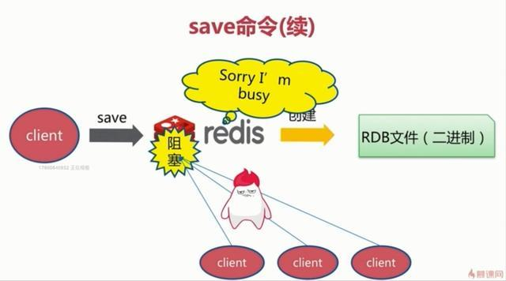
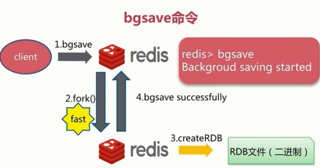
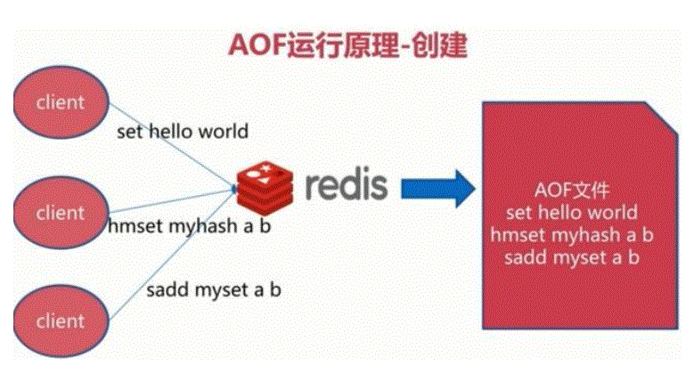
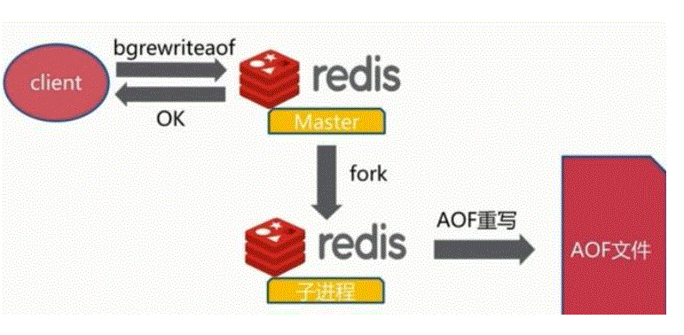
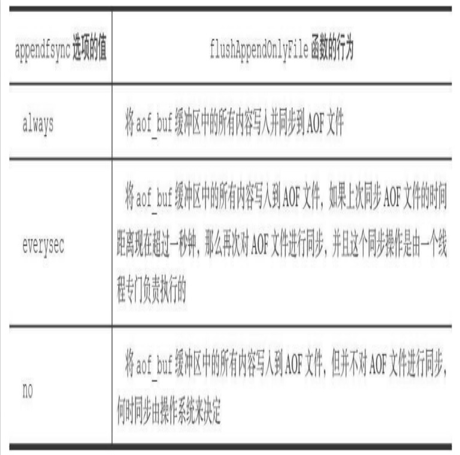

# Redis的持久化

Redis虽然是内存缓存，但还是提供了持久化机制，分别是RDB、AOF和RAOF。

## 数据持久化过程

1. 系统收到需要持久化的数据，此时数据在应用程序的内存中。
2. 系统调用write系统调用，将数据写入磁盘，此时数据可能并没有真正的持久化到磁盘，数据在操作系统的缓冲区中。
3. 操作系统将缓冲区中的数据输出到磁盘控制器，此时数据在磁盘的缓存上。
4. 磁盘控制器将数据写入到磁盘的物理介质上，数据真正的写入到磁盘，在任何情况下可以再次被读取。

从上面的过程可以看到有两种情况的故障：
1. 系统发生故障，只要1、2完成，那么就可以持久化，剩下的3、4操作系统会完成。
2. 操作系统故障，机器故障，只有1、2、3、4都完成，才能持久化。

## RDB持久化

RDB持久化就是将内存中的数据集以快照的形式写入到一个二进制文件中，以持久化到磁盘上，redis中默认的文件名为dump.rdb。

既然RDB持久化是在某个时刻将所有数据生成一个快照保存，那么就需要一个触发机制，以完成这个过程。Redis提供了三种机制：save、bgsave、自动化。

### save触发方式

save方式会阻塞Redis的服务，在save期间，Redis不能处理其他命令，直到save过程完成，流程如下：

save完成后，如果有老的RDB，则用新生成的RDB替换老的。

### bgsave触发方式

bgsave会fork子进程从而在后台异步完成快照操作，而前台的父进程可以继续响应客户端请求。

### 自动触发

因为BGSAVE命令可以在不阻塞服务器进程的情况下执行，所以Redis允许用户通过设置服务器配置的save选项，让服务器每隔一段时间自动执行一次BGSAVE命令。

用户可以通过save选项设置多个保存条件，但只要其中任意一个条件被满足，服务器就会执行BGSAVE命令。

### RDB的优势和劣势

+ 优势
    + RDB文件紧凑，全量备份，非常适合用于进行备份和灾难恢复。
    + 生成RDB文件的时候，redis主进程会fork()一个子进程来处理所有保存工作，主进程不需要进行任何磁盘IO操作。
    + RDB 在恢复大数据集时的速度比 AOF 的恢复速度要快。
+ 劣势
    + 在子进程快照持久化期间主进程修改的数据不会被保存，可能丢失数据。
    + RDB式全量备份，每次会进行大量的磁盘IO，耗时久。

## AOF持久化

AOF工作机制很简单，redis会将每一个收到的写命令都通过write函数追加到文件中。通俗的理解就是日志记录。

### 持久化原理

### AOF文件重写原理
AOF的方式也同时带来了另一个问题。持久化文件会变的越来越大。为了压缩aof的持久化文件。redis提供了bgrewriteaof命令。将内存中的数据以命令的方式保存到临时文件中，同时会fork出一条新进程来将文件重写。

### AOF触发方式

+ 每修改同步 always：同步持久化 每次发生数据变更会被立即记录到磁盘 性能较差但数据完整性比较好。
+ 每秒同步 everysec：异步操作，每秒记录 如果一秒内宕机，有数据丢失。
+ 不同 no：从不同步。

### AOF优缺点

+ 优点
    + AOF可以更好的保护数据不丢失，一般AOF会每隔1秒，通过一个后台线程执行一次fsync操作，最多丢失1秒钟的数据。
    + AOF日志文件没有任何磁盘寻址的开销，写入性能非常高，文件不容易破损。
    + AOF日志文件即使过大的时候，出现后台重写操作，也不会影响客户端的读写。
    + AOF日志文件的命令通过非常可读的方式进行记录，这个特性非常适合做灾难性的误删除的紧急恢复。比如某人不小心用flushall命令清空了所有数据，只要这个时候后台rewrite还没有发生，那么就可以立即拷贝AOF文件，将最后一条flushall命令给删了，然后再将该AOF文件放回去，就可以通过恢复机制，自动恢复所有数据
+ 缺点
    + 对于同一份数据来说，AOF日志文件通常比RDB数据快照文件更大
    + AOF开启后，支持的写QPS会比RDB支持的写QPS低，因为AOF一般会配置成每秒fsync一次日志文件，当然，每秒一次fsync，性能也还是很高的
    + 以前AOF发生过bug，就是通过AOF记录的日志，进行数据恢复的时候，没有恢复一模一样的数据出来。

