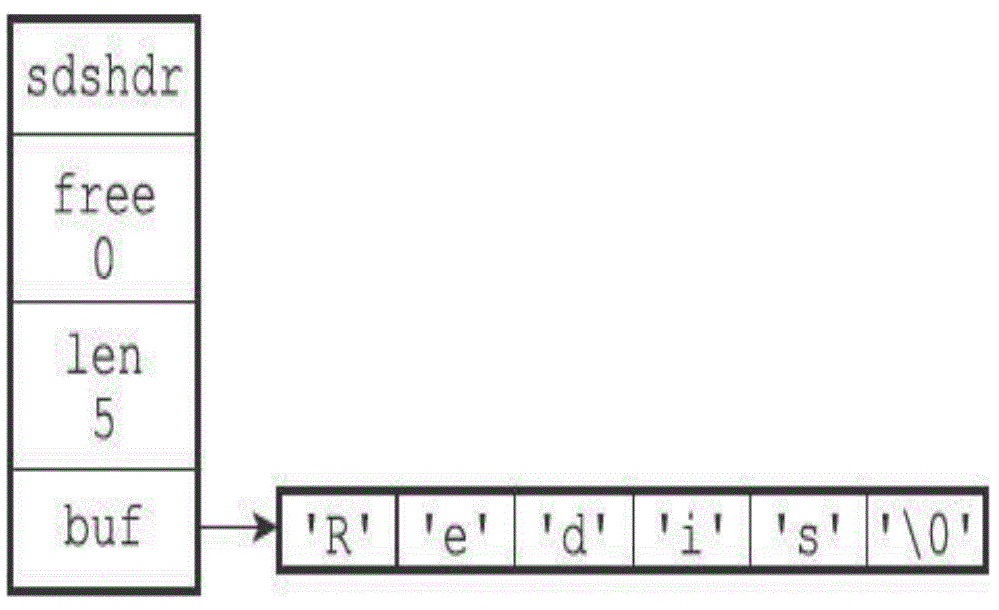
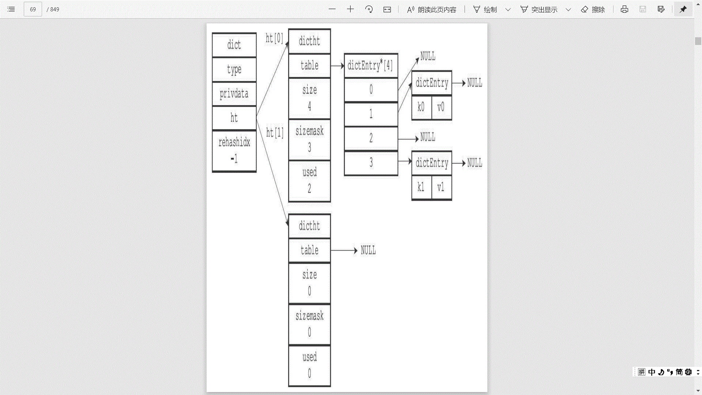
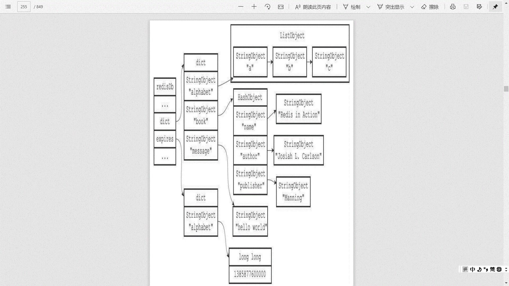

# Redis数据策略

## SDS

### SDS数据结构

### 为什么使用SDS

+ 常数时间获取字符串长度
+ 杜绝缓冲区溢出
+ 减少内存重分配次数(机制类似go语言的slice)
    + 空间预分配
    + 惰性空间释放
+ 二进制安全

## hash table

+ 当要将一个新的键值对添加到字典里面时，程序需要先根据键值对的键计算出哈希值和索引值，然后再根据索引值，将包含新键值对的哈希表节点放到哈希表数组的指定索引上面。
+ Redis的哈希表使用链地址法（separate chaining）来解决键冲突，每个哈希表节点都有一个next指针，多个哈希表节点可以用next指针构成一个单向链表，被分配到同一个索引上的多个节点可以用这个单向链表连接起来，这就解决了键冲突的问题。
+ 随着操作的不断执行，哈希表保存的键值对会逐渐地增多或者减少，为了让哈希表的负载因子（load factor）维持在一个合理的范围之内，当哈希表保存的键值对数量太多或者太少时，程序需要对哈希表的大小进行相应的扩展或者收缩。
    + 为字典的ht[1]哈希表分配空间，这个哈希表的空间大小取决于要执行的操作，以及ht[0]当前包含的键值对数量（也即是ht[0].used属性的值）：
        + 如果执行的是扩展操作，那么ht[1]的大小为第一个大于等于ht[0].used*2的2n（2的n次方幂）；
        + 如果执行的是收缩操作，那么ht[1]的大小为第一个大于等于ht[0].used的2n。
    + 将保存在ht[0]中的所有键值对rehash到ht[1]上面：rehash指的是重新计算键的哈希值和索引值，然后将键值对放置到ht[1]哈希表的指定位置上。
    + 当ht[0]包含的所有键值对都迁移到了ht[1]之后（ht[0]变为空表），释放ht[0]，将ht[1]设置为ht[0]，并在ht[1]新创建一个空白哈希表，为下一次rehash做准备。

### 渐进式hash

+ 为ht[1]分配空间，让字典同时持有ht[0]和ht[1]两个哈希表。
+ 在字典中维持一个索引计数器变量rehashidx，并将它的值设置为0，表示rehash工作正式开始。
+ 在rehash进行期间，每次对字典执行添加、删除、查找或者更新操作时，程序除了执行指定的操作以外，还会顺带将ht[0]哈希表在rehashidx索引上的所有键值对rehash到ht[1]，当rehash工作完成之后，程序将rehashidx属性的值增一。
+ 随着字典操作的不断执行，最终在某个时间点上，ht[0]的所有键值对都会被rehash至ht[1]，这时程序将rehashidx属性的值设为-1，表示rehash操作已完成。

渐进式rehash的好处在于它采取分而治之的方式，将rehash键值对所需的计算工作均摊到对字典的每个添加、删除、查找和更新操作上，从而避免了集中式rehash而带来的庞大计算量。

## skiplist

+ [redis为什么使用skiplist而不是平衡树](https://zhuanlan.zhihu.com/p/23370124)

## 过期键

过期键的三种删除策略：
+ 定时删除：在设置键的过期时间的同时，创建一个定时器（timer），让定时器在键的过期时间来临时，立即执行对键的删除操作
    + 定时删除策略对内存是最友好的：通过使用定时器，定时删除策略可以保证过期键会尽可能快地被删除，并释放过期键所占用的内存。
    + 定时删除策略的缺点是，它对CPU时间是最不友好的：在过期键比较多的情况下，删除过期键这一行为可能会占用相当一部分CPU时间，在内存不紧张但是CPU时间非常紧张的情况下，将CPU时间用在删除和当前任务无关的过期键上，无疑会对服务器的响应时间和吞吐量造成影响。
+ 惰性删除：放任键过期不管，但是每次从键空间中获取键时，都检查取得的键是否过期，如果过期的话，就删除该键；如果没有过期，就返回该键。
    + 惰性删除策略对CPU时间来说是最友好的：程序只会在取出键时才对键进行过期检查，这可以保证删除过期键的操作只会在非做不可的情况下进行，并且删除的目标仅限于当前处理的键，这个策略不会在删除其他无关的过期键上花费任何CPU时间。
    + 惰性删除策略的缺点是，它对内存是最不友好的：如果一个键已经过期，而这个键又仍然保留在数据库中，那么只要这个过期键不被删除，它所占用的内存就不会释放。
    + 在使用惰性删除策略时，如果数据库中有非常多的过期键，而这些过期键又恰好没有被访问到的话，那么它们也许永远也不会被删除（除非用户手动执行FLUSHDB），我们甚至可以将这种情况看作是一种内存泄漏——无用的垃圾数据占用了大量的内存，而服务器却不会自己去释放它们，这对于运行状态非常依赖于内存的Redis服务器来说，肯定不是一个好消息。
+ 定期删除：每隔一段时间，程序就对数据库进行一次检查，删除里面的过期键。至于要删除多少过期键，以及要检查多少个数据库，则由算法决定。
    + 从上面对定时删除和惰性删除的讨论来看，这两种删除方式在单一使用时都有明显的缺陷：
        + 定时删除占用太多CPU时间，影响服务器的响应时间和吞吐量。
        + 惰性删除浪费太多内存，有内存泄漏的危险。
    + 定期删除策略是前两种策略的一种整合和折中：
        + 定期删除策略每隔一段时间执行一次删除过期键操作，并通过限制删除操作执行的时长和频率来减少删除操作对CPU时间的影响。
        + 通过定期删除过期键，定期删除策略有效地减少了因为过期键而带来的内存浪费。
    + 定期删除策略的难点是确定删除操作执行的时长和频率：
        + 如果删除操作执行得太频繁，或者执行的时间太长，定期删除策略就会退化成定时删除策略，以至于将CPU时间过多地消耗在删除过期键上面。
        + 如果删除操作执行得太少，或者执行的时间太短，定期删除策略又会和惰性删除策略一样，出现浪费内存的情况。

Redis过期键策略：
Redis实际使用的是惰性删除和定期删除两种策略：通过配合使用这两种删除策略，服务器可以很好地在合理使用CPU时间和避免浪费内存空间之间取得平衡。

+ 过期键的惰性删除策略由db.c/expireIfNeeded函数实现，所有读写数据库的Redis命令在执行之前都会调用expireIfNeeded函数对输入键进行检查：
    + 如果输入键已经过期，那么expireIfNeeded函数将输入键从数据库中删除。
    + 如果输入键未过期，那么expireIfNeeded函数不做动作。
+ 过期键的定期删除策略由redis.c/activeExpireCy cle函数实现，每当Redis的服务器周期性操作redis.c/serverCron函数执行时，activeExpireCycle函数就会被调用，它在规定的时间内，分多次遍历服务器中的各个数据库，从数据库的expires字典中随机检查一部分键的过期时间，并删除其中的过期键。

## 内存淘汰策略

不管是定期采样删除还是惰性删除都不是一种完全精准的删除，就还是会存在key没有被删除掉的场景，所以就需要内存淘汰策略进行补充。

redis内存淘汰策略：
1. noeviction：当内存使用超过配置的时候会返回错误，不会驱逐任何键
2. allkeys-lru：加入键的时候，如果过限，首先通过LRU算法驱逐最久没有使用的键
3. volatile-lru：加入键的时候如果过限，首先从设置了过期时间的键集合中驱逐最久没有使用的键
4. allkeys-random：加入键的时候如果过限，从所有key随机删除
5. volatile-random：加入键的时候如果过限，从过期键的集合中随机驱逐
6. volatile-ttl：从配置了过期时间的键中驱逐马上就要过期的键
7. volatile-lfu：从所有配置了过期时间的键中驱逐使用频率最少的键
8. allkeys-lfu：从所有键中驱逐使用频率最少的键

## LRU

[Redis的内存淘汰策略](https://zhuanlan.zhihu.com/p/105587132)

