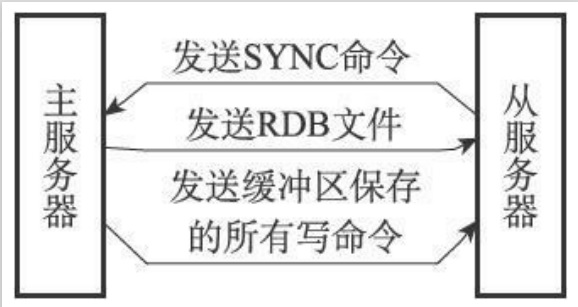
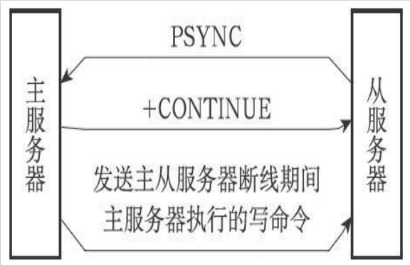

# Redis的主从

Redis的复制功能分为同步（sync）和命令传播（command propagate）两个操作：
+ 同步操作用于将从服务器的数据库状态更新至主服务器当前所处的数据库状态。
+ 命令传播操作则用于在主服务器的数据库状态被修改，导致主从服务器的数据库状态出现不一致时，让主从服务器的数据库重新回到一致状态。

## Redis的主从同步

### 旧版同步

1. 同步

从服务器对主服务器的同步操作需要通过向主服务器发送SYNC命令来完成，以下是SYNC命令的执行步骤：
+ 从服务器向主服务器发送SYNC命令。
+ 收到SYNC命令的主服务器执行BGSAVE命令，在后台生成一个RDB文件，并使用一个缓冲区记录从现在开始执行的所有写命令。
+ 当主服务器的BGSAVE命令执行完毕时，主服务器会将BGSAVE命令生成的RDB文件发送给从服务器，从服务器接收并载入这个RDB文件，将自己的数据库状态更新至主服务器执行BGSAVE命令时的数据库状态。
+ 主服务器将记录在缓冲区里面的所有写命令发送给从服务器，从服务器执行这些写命令，将自己的数据库状态更新至主服务器数据库当前所处的状态。

2. 命令传播

主服务器会将自己执行的写命令，也即是造成主从服务器不一致的那条写命令，发送给从服务器执行，当从服务器执行了相同的写命令之后，主从服务器将再次回到一致状态。

### 旧版同步缺陷

无论是初始同步还是断线重连后的同步，都是完整重同步模式。

### 新版同步

新版同步增加部分重同步处理断线重连后的同步。

当从服务器在断线后重新连接主服务器时，如果条件允许，主服务器可以将主从服务器连接断开期间执行的写命令发送给从服务器，从服务器只要接收并执行这些写命令，就可以将数据库更新至主服务器当前所处的状态。

### 部分重同步的实现

部分重同步功能由以下三个部分构成：
+ 主服务器的复制偏移量（replication offset）和从服务器的复制偏移量，执行复制的双方——主服务器和从服务器会分别维护一个复制偏移量。
+ 主服务器的复制积压缓冲区（replication backlog）。
+ 服务器的运行ID（run ID）。

## Redis的故障转移

### sentinel检测主观下线状态

在默认情况下，Sentinel会以每秒一次的频率向所有与它创建了命令连接的实例（包括主服务器、从服务器、其他Sentinel在内）发送PING命令，并通过实例返回的PING命令回复来判断实例是否在线。

### sentinel检测客观下线状态

当Sentinel将一个主服务器判断为主观下线之后，为了确认这个主服务器是否真的下线了，它会向同样监视这一主服务器的其他Sentinel进行询问，看它们是否也认为主服务器已经进入了下线状态（可以是主观下线或者客观下线）。当Sentinel从其他Sentinel那里接收到足够数量的已下线判断之后，Sentinel就会将从服务器判定为客观下线，并对主服务器执行故障转移操作。

### 选举领头Sentinel

当一个主服务器被判断为客观下线时，监视这个下线主服务器的各个Sentinel会进行协商，选举出一个领头Sentinel，并由领头Sentinel对下线主服务器执行故障转移操作。
以下是Redis选举领头Sentinel的规则和方法：

+ 所有在线的Sentinel都有被选为领头Sentinel的资格，换句话说，监视同一个主服务器的多个在线Sentinel中的任意一个都有可能成为领头Sentinel。
+ 每次进行领头Sentinel选举之后，不论选举是否成功，所有Sentinel的配置纪元（configuration epoch）的值都会自增一次。配置纪元实际上就是一个计数器，并没有什么特别的。
+ 在一个配置纪元里面，所有Sentinel都有一次将某个Sentinel设置为局部领头Sentinel的机会，并且局部领头一旦设置，在这个配置纪元里面就不能再更改。
+ 每个发现主服务器进入客观下线的Sentinel都会要求其他Sentinel将自己设置为局部领头Sentinel。
+ 当一个Sentinel（源Sentinel）向另一个Sentinel（目标Sentinel）发送SENTINEL ismaster-down-by-addr命令，并且命令中的runid参数不是*符号而是源Sentinel的运行ID时，这表示源Sentinel要求目标Sentinel将前者设置为后者的局部领头Sentinel。
+ Sentinel设置局部领头Sentinel的规则是先到先得：最先向目标Sentinel发送设置要求的源Sentinel将成为目标Sentinel的局部领头Sentinel，而之后接收到的所有设置要求都会被目标Sentinel拒绝。
+ 目标Sentinel在接收到SENTINEL is-master-down-by-addr命令之后，将向源Sentinel返回一条命令回复，回复中的leader_runid参数和leader_epoch参数分别记录了目标Sentinel的局部领头Sentinel的运行ID和配置纪元。
+ 源Sentinel在接收到目标Sentinel返回的命令回复之后，会检查回复中leader_epoch参数的值和自己的配置纪元是否相同，如果相同的话，那么源Sentinel继续取出回复中的leader_runid参数，如果leader_runid参数的值和源Sentinel的运行ID一致，那么表示目标Sentinel将源Sentinel设置成了局部领头Sentinel。
+ 如果有某个Sentinel被半数以上的Sentinel设置成了局部领头Sentinel，那么这个Sentinel成为领头Sentinel。举个例子，在一个由10个Sentinel组成的Sentinel系统里面，只要有大于等于10/2+1=6个Sentinel将某个Sentinel设置为局部领头Sentinel，那么被设置的那个Sentinel就会成为领头Sentinel。
+ 因为领头Sentinel的产生需要半数以上Sentinel的支持，并且每个Sentinel在每个配置纪元里面只能设置一次局部领头Sentinel，所以在一个配置纪元里面，只会出现一个领头Sentinel。
+ 如果在给定时限内，没有一个Sentinel被选举为领头Sentinel，那么各个Sentinel将在一段时间之后再次进行选举，直到选出领头Sentinel为止。

### 故障转移

在选举产生出领头Sentinel之后，领头Sentinel将对已下线的主服务器执行故障转移操作，该操作包含以下三个步骤：
+ 在已下线主服务器属下的所有从服务器里面，挑选出一个从服务器，并将其转换为主服务器。
+ 让已下线主服务器属下的所有从服务器改为复制新的主服务器。
+ 将已下线主服务器设置为新的主服务器的从服务器，当这个旧的主服务器重新上线时，它就会成为新的主服务器的从服务器。

### 如何选择新主服务器

领头Sentinel会将已下线主服务器的所有从服务器保存到一个列表里面，然后按照以下规则，一项一项地对列表进行过滤：
+ 删除列表中所有处于下线或者断线状态的从服务器，这可以保证列表中剩余的从服务器都是正常在线的。
+ 删除列表中所有最近五秒内没有回复过领头Sentinel的INFO命令的从服务器，这可以保证列表中剩余的从服务器都是最近成功进行过通信的。
+ 删除所有与已下线主服务器连接断开超过down-after-milliseconds*10毫秒的从服务器：down-after-milliseconds选项指定了判断主服务器下线所需的时间，而删除断开时长超过down-after-milliseconds*10毫秒的从服务器，则可以保证列表中剩余的从服务器都没有过早地与主服务器断开连接，换句话说，列表中剩余的从服务器保存的数据都是比较新的。

1. 领头Sentinel将根据从服务器的优先级，对列表中剩余的从服务器进行排序，并选出其中优先级最高的从服务器。
2. 如果有多个具有相同最高优先级的从服务器，那么领头Sentinel将按照从服务器的复制偏移量，对具有相同最高优先级的所有从服务器进行排序，并选出其中偏移量最大的从服务器（复制偏移量最大的从服务器就是保存着最新数据的从服务器）。
3. 如果有多个优先级最高、复制偏移量最大的从服务器，那么领头Sentinel将按照运行ID对这些从服务器进行排序，并选出其中运行ID最小的从服务器。

### 修改从服务器复制目标

当新的主服务器出现之后，领头Sentinel下一步要做的就是，让已下线主服务器属下的所有从服务器去复制新的主服务器，这一动作可以通过向从服务器发送SLAVEOF命令来实现。

### 将旧的主服务器变为从服务器

故障转移操作最后要做的是，将已下线的主服务器设置为新的主服务器的从服务器。