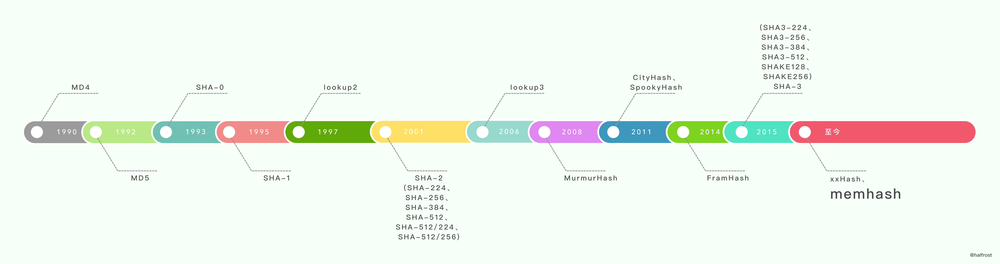

# 哈希函数

## 哈希函数的应用

哈希函数在很多场景需要用到，如

+ 在hash map中，需要对key进行hash从而使得key可以随机落入到一个桶中，期望key可以等概率的进入到每一个桶中。
+ 在redis的数据分片中，根据key的hash来决定该数据将存入哪个分片中。还有memcached中。
+ 为证明数据有效性，会提供其hash，使用hash来验证数据有效性，进行数据的错误检查。（hash只能验错，不能纠错）
+ 密码学中对数据hash进行签名。

## 哈希函数的历史

说到哈希函数，不得不说[Bob Jenkins](http://burtleburtle.net/bob/),1997年，Bob Jenkins发表了一篇关于哈希函数的文章[A hash function for hash table lookup](http://www.burtleburtle.net/bob/hash/doobs.html)，在这篇文章中，Bob广泛收录了很多已有的哈希函数，也有他自己设计的lookup2。在2006年，Bob发布了lookup3，又称为Jenkins Hash。更多关于Bob的哈希函数的内容可以参考wiki [Jenkins hash function](http://en.wikipedia.org/wiki/Jenkins_hash_function)。2011年，Bob发布了一个新的哈希函数SpookyHash

目前已经有很多广泛使用的哈希算法，每个算法有其特性和应用场景。

+ MD4
+ MD5
+ SHA0
+ SHA1
+ SHA2(SHA256/SHA512)
+ SHA3(SHA256/SHA512)
+ lookup2/lookup3/SpookyHash
+ MurmurHash
+ CityHash/FarmHash
+ xxHash
+ memhash
+ AES Hash

## 哈希函数的要求

哈希函数的应用场景不一样，要求也不一样，在数据分片和hash table中，对hash的要求是随机和速度，在密码学中，对hash的要求是不能穷举破解。

### 加密型哈希函数

加密性哈希函数对抗分析、抗穷举要求更高。

用于消息摘要的MD4和MD5，要求hash安全，可以抗分析和抗差分。

SHA是Secure Hash Algorithm(安全哈希算法)的简称，其主要用于数字签名。

SHA1用于数字签名DSA中，对hash的抗穷举性要求更高，也是最常见的指纹算法。

### 非加密型哈希函数

非加密型哈希函数主要用于数据分片、哈希检索，其对性能有很高的要求。

lookup2/lookup3/SpookyHash/MurmurHash/memHash

memcached的哈希算法使用了lookup2和murmur3。

murmur3由于其优异的性能，在redis、memcached、cassandra、hbase、lucene中被使用。

FarmHash和CityHash也是非加密型哈希函数，但其是字符串哈希算法，都是由Google发布。

xxHash也是非加密型哈希函数，该hash算法速度接近于RAM的极限，在PrestoDB，RocksDB、Mysql、ArangoDB、PGroonga、Spark数据库中用于数据错误检查。

AES Hash使用了AES指令集，能提供硬件加速，其性能会很优秀。

Go语言中的map使用的哈希函数是memhash和AES Hash，当CPU支持AES指令集的时候，选择AES Hash，否则选择memhash。