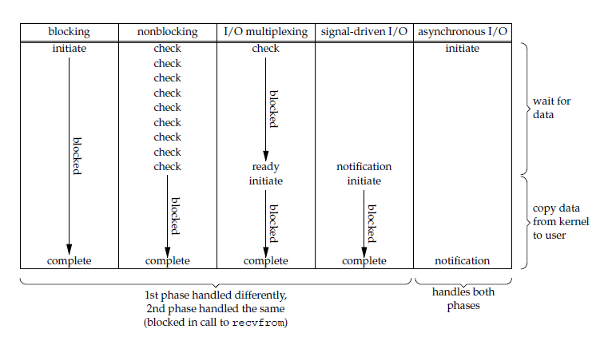
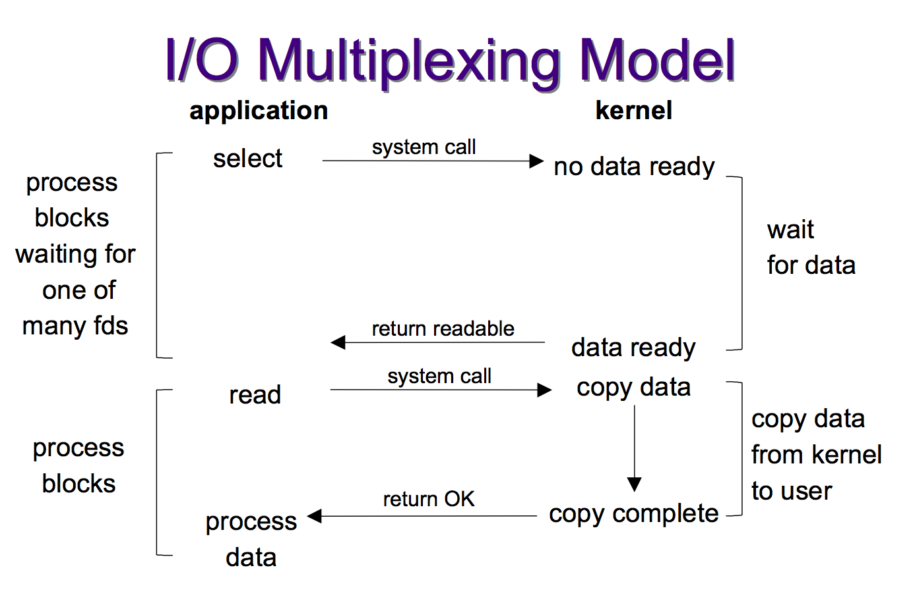

# 多路复用

## IO模型
如下图是几种IO模型的对比，更详细请参考[unix io 模型](unix io模型.md)



从上面的图可以看出，从左到右，越往后，阻塞越少，理论上效率也就越优。

其中Select对应的是第三种IO模型：I/O Multiplexing IO多路复用模型，而epoll与kqueue其实和Select一样也属于I/O Multiplexing IO多路复用模型，只是相比于select来说多了一些高级特性而已，可以看做拥有了第四种模型的某些特性，比如callback的回调机制。

IO多路复用的好处就在于单个process就可以同时处理多个网络连接的IO。它的基本原理就是select，poll，epoll，kqueue这些个function会不断的轮询所负责的所有socket，当某个socket就绪（一般是读就绪或者写就绪），就通知用户进程。

## IO多路复用模型



当用户进程调用了select，那么整个进程会被block，而同时，kernel会“监视”所有select负责的socket，当任何一个socket中的数据准备好了，select就会返回。这个时候用户进程再调用read操作，将数据从kernel拷贝到用户进程。

所以，I/O 多路复用的特点是通过一种机制一个进程能同时等待多个文件描述符，而这些文件描述符（套接字描述符）其中的任意一个进入读就绪状态，select()函数就可以返回。

## select

```
int select (int n, fd_set *readfds, fd_set *writefds, fd_set *exceptfds, struct timeval *timeout);
```
select 函数监视的文件描述符分3类，分别是:
+ writefds
+ readfds
+ exceptfds
调用后select函数会阻塞，直到有描述副就绪（有数据 可读、可写、或者有except），或者超时（timeout指定等待时间，如果立即返回设为null即可），函数返回。当select函数返回后，可以 通过遍历fdset，来找到就绪的描述符。

select的优点：
+ 跨平台，select目前几乎在所有的平台上支持，其良好跨平台支持也是它的一个优点。

select的缺点：
+ 单个进程打开的文件描述是有一定限制的，它由FD_SETSIZE设置，默认值是1024，采用数组存储，虽然可以通过编译内核改变，但相对麻烦。
+ 另外在检查数组中是否有文件描述需要读写时，采用的是线性扫描的方法，即不管这些socket是不是活跃的，我都轮询一遍，所以效率比较低。

# poll

```
int poll (struct pollfd *fds, unsigned int nfds, int timeout);
```
不同与select使用三个位图来表示三个fdset的方式，poll使用一个 pollfd的指针实现。
```
struct pollfd {
    int fd; /* file descriptor */
    short events; /* requested events to watch */
    short revents; /* returned events witnessed */
};
```
pollfd结构包含了要监视的event和发生的event，不再使用select“参数-值”传递的方式。

poll优点：
+ 采样链表的形式存储，它监听的描述符数量没有限制，可以超过select默认限制的1024大小。

poll的缺点：
+ 类似select，另外在检查链表中是否有文件描述需要读写时，采用的是线性扫描的方法，即不管这些socket是不是活跃的，我都轮询一遍，所以效率比较低。

## epoll
epoll是在2.6内核中提出的，是之前的select和poll的增强版本。相对于select和poll来说，epoll更加灵活，没有描述符限制。epoll使用一个文件描述符管理多个描述符，将用户关系的文件描述符的事件存放到内核的一个事件表中，这样在用户空间和内核空间的copy只需一次。

```
int epoll_create(int size)；
int epoll_ctl(int epfd, int op, int fd, struct epoll_event *event)；
int epoll_wait(int epfd, struct epoll_event * events, int maxevents, int timeout);
```

+ int epoll_create(int size);

创建一个epoll的句柄，size用来告诉内核这个监听的数目一共有多大，这个参数不同于select()中的第一个参数，给出最大监听的fd+1的值，参数size并不是限制了epoll所能监听的描述符最大个数，只是对内核初始分配内部数据结构的一个建议。

当创建好epoll句柄后，它就会占用一个fd值，在linux下如果查看/proc/进程id/fd/，是能够看到这个fd的，所以在使用完epoll后，必须调用close()关闭，否则可能导致fd被耗尽。

+ int epoll_ctl(int epfd, int op, int fd, struct epoll_event *event)；

函数是对指定描述符fd执行op操作。
    + epfd：是epoll_create()的返回值。
    + op：表示op操作，用三个宏来分别表示对fd添加、删除和修改监听事件。
        + EPOLL_CTL_ADD 添加
        + EPOLL_CTL_DEL 删除
        + EPOLL_CTL_MOD 修改。
    + fd：是需要监听的fd（文件描述符）
    + epoll_event：是告诉内核需要监听什么事，struct epoll_event结构如下：

```
struct epoll_event {
  __uint32_t events;  /* Epoll events */
  epoll_data_t data;  /* User data variable */
};

//events可以是以下几个宏的集合：
EPOLLIN ：表示对应的文件描述符可以读（包括对端SOCKET正常关闭）；
EPOLLOUT：表示对应的文件描述符可以写；
EPOLLPRI：表示对应的文件描述符有紧急的数据可读（这里应该表示有带外数据到来）；
EPOLLERR：表示对应的文件描述符发生错误；
EPOLLHUP：表示对应的文件描述符被挂断；
EPOLLET： 将EPOLL设为边缘触发(Edge Triggered)模式，这是相对于水平触发(Level Triggered)来说的。
EPOLLONESHOT：只监听一次事件，当监听完这次事件之后，如果还需要继续监听这个socket的话，需要再次把这个socket加入到EPOLL队列里
```

+ int epoll_wait(int epfd, struct epoll_event * events, int maxevents, int timeout);
等待epfd上的io事件，最多返回maxevents个事件。 参数events用来从内核得到事件的集合，maxevents告之内核这个events有多大，这个maxevents的值不能大于创建epoll_create()时的size，参数timeout是超时时间（毫秒，0会立即返回，-1将不确定，也有说法说是永久阻塞）。该函数返回需要处理的事件数目，如返回0表示已超时。

epoll工作模式：

poll对文件描述符的操作有两种模式：LT（level trigger）和ET（edge trigger）。LT模式是默认模式，LT模式与ET模式的区别如下：

+ LT模式：当epoll_wait检测到描述符事件发生并将此事件通知应用程序，应用程序可以不立即处理该事件。下次调用epoll_wait时，会再次响应应用程序并通知此事件。

LT(level triggered)是缺省的工作方式，并且同时支持block和no-block socket.在这种做法中，内核告诉你一个文件描述符是否就绪了，然后你可以对这个就绪的fd进行IO操作。如果你不作任何操作，内核还是会继续通知你的。
ET模式：当epoll_wait检测到描述符事件发生并将此事件通知应用程序，应用程序必须立即处理该事件。如果不处理，下次调用epoll_wait时，不会再次响应应用程序并通知此事件。

+ ET(edge-triggered)是高速工作方式，只支持no-block socket。在这种模式下，当描述符从未就绪变为就绪时，内核通过epoll告诉你。然后它会假设你知道文件描述符已经就绪，并且不会再为那个文件描述符发送更多的就绪通知，直到你做了某些操作导致那个文件描述符不再为就绪状态了(比如，你在发送，接收或者接收请求，或者发送接收的数据少于一定量时导致了一个EWOULDBLOCK 错误）。但是请注意，如果一直不对这个fd作IO操作(从而导致它再次变成未就绪)，内核不会发送更多的通知(only once)
ET模式在很大程度上减少了epoll事件被重复触发的次数，因此效率要比LT模式高。epoll工作在ET模式的时候，必须使用非阻塞套接口，以避免由于一个文件句柄的阻塞读/阻塞写操作把处理多个文件描述符的任务饿死。

在 select/poll中，进程只有在调用一定的方法后，内核才对所有监视的文件描述符进行扫描。

而epoll事先通过epoll_ctl()来注册一个文件描述符，一旦基于某个文件描述符就绪时，内核会采用类似callback的回调机制，迅速激活这个文件描述符，当进程调用epoll_wait()时便得到通知。(此处去掉了遍历文件描述符，而是通过监听回调的的机制。这正是epoll的魅力所在。)

epoll优点：
+ 监视的描述符数量不受限制，它所支持的FD上限是最大可以打开文件的数目，这个数字一般远大于2048,举个例子,在1GB内存的机器上大约是10万左 右，具体数目可以cat /proc/sys/fs/file-max察看,一般来说这个数目和系统内存关系很大。select的最大缺点就是进程打开的fd是有数量限制的。这对 于连接数量比较大的服务器来说根本不能满足。虽然也可以选择多进程的解决方案( Apache就是这样实现的)，不过虽然linux上面创建进程的代价比较小，但仍旧是不可忽视的，加上进程间数据同步远比不上线程间同步的高效，所以也不是一种完美的方案。

+ IO的效率不会随着监视fd的数量的增长而下降。epoll不同于select和poll轮询的方式，而是通过每个fd定义的回调函数来实现的。只有就绪的fd才会执行回调函数。

如果没有大量的idle -connection或者dead-connection，epoll的效率并不会比select/poll高很多，但是当遇到大量的idle- connection，就会发现epoll的效率大大高于select/poll。

## kqueue

kqueue与epoll非常相似，最初是2000年Jonathan Lemon在FreeBSD系统上开发的一个高性能的事件通知接口。注册一批socket描述符到 kqueue 以后，当其中的描述符状态发生变化时，kqueue 将一次性通知应用程序哪些描述符可读、可写或出错了。

## 其他

+ 只有IOCP是asynchronous I/O，其他机制或多或少都会有一点阻塞。
+ select低效是因为每次它都需要轮询。但低效也是相对的，视情况而定，也可通过良好的设计改善
+ epoll, kqueue是Reacor模式，IOCP是Proactor模式。
+ java nio包是select模型
