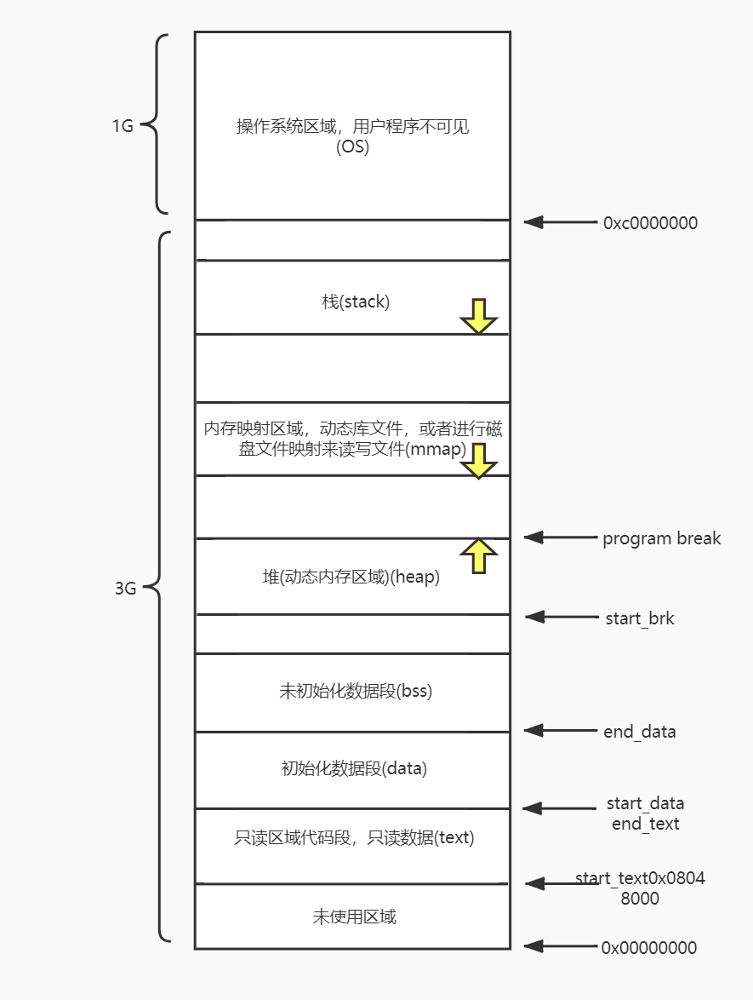

# 应用程序内存管理

## 进程空间

在一个应用程序被操作系统加载后会为其创建一个进程，这个进程拥有自己独立的进程空间，整个进程空间的高地址区域0xC0000000-0xFFFFFFFF 共1G被操作系统占用，称为操作系统空间，低地址空间0x00000000-0xBFFFFFFF，共3G被应用程序使用，称为应用程序空间。

应用程序空间根据应用程序的需要被划分为多个区域，称为段。包括text，data，bss,heap，mmap，stack。



应用程序在编译期间就确定了text，data，bss和stack的内存使用，heap和mmap由应用程序动态管理和维护。后续主要关注应用程序动态管理和维护的heap和mmap。

## heap的管理维护

在应用程序被加载，操作系统为其创建进程后，会初始化heap的开始位置，参考上图的start brk，heap空间的管理就交给了应用程序。

由于heap空间区域的虚拟地址并未被映射到物理地址，并不能使用，我们认为是未分配空间(unallocated space)，要想使用这些空间的内存，需要分配空间，这是用操作系统提供的管理和维护heap的接口来完成，操作系统提供有以下两个接口，内容摘自Linux Programmer's Manual。

SYNOPSIS
```
#include <unistd.h>
int brk(void *addr);
void *sbrk(intptr_t incr);
```

DESCRIPTION
```
The brk() and sbrk() functions are used to change the amount of space allocated for the calling process. The change is made by resetting the process' break value and allocating the appropriate amount of space. The amount of allocated space increases as the break value increases. The newly-allocated space is set to 0. However, if the application first decrements and then increments the break value, the contents of the reallocated space are unspecified.

The brk() function sets the break value to addr and changes the allocated space accordingly.

The sbrk() function adds incr bytes to the break value and changes the allocated space accordingly. If incr is negative, the amount of allocated space is decreased by incr bytes. The current value of the program break is returned by sbrk(0).

The behaviour of brk() and sbrk() is unspecified if an application also uses any other memory functions (such as malloc(), mmap(), free()). Other functions may use these other memory functions silently.

It is unspecified whether the pointer returned by sbrk() is aligned suitably for any purpose.

These interfaces need not be reentrant.
```

RETURN VALUE
```
Upon successful completion, brk() returns 0. Otherwise, it returns -1 and sets errno to indicate the error.
Upon successful completion, sbrk() returns the prior break value. Otherwise, it returns (void *)-1 and sets errno to indicate the error.
```

ERRORS
```
The brk() and sbrk() functions will fail if:
[ENOMEM]
The requested change would allocate more space than allowed.
The brk() and sbrk() functions may fail if:
[EAGAIN]
The total amount of system memory available for allocation to this process is temporarily insufficient. This may occur even though the space requested was less than the maximum data segment size.
[ENOMEM]
The requested change would be impossible as there is insufficient swap space available, or would cause a memory allocation conflict.
```

APPLICATION USAGE
```
The brk() and sbrk() functions have been used in specialised cases where no other memory allocation function provided the same capability. The use of malloc() is now preferred because it can be used portably with all other memory allocation functions and with any function that uses other allocation functions.
```
sbrk从heap的program break位置(也就是heap的最高位置或者堆未分配空间的最低位置)开始分配incr大小的空间，也就是将这个空间上的虚拟地址映射到物理地址，使得地址空间可以被访问，program break = program break + incr，返回值是分配空间之前的program break。

如果incr为负值，那就是从heap的program break位置开始回收incr大小的空间，操作系统回收物理内存，这个空间上的虚拟地址不能被访问，program break = program break - abs(incr)。

如果incr为0，那么就返回当前的program break。

brk将heap的program break位置设置为指定的addr，如果addr>program break，则分配空间，否则就是回收空间。

sbrk和brk只能将整个heap的空间扩大和缩小，而且它属于系统调用，有用户态和内核态的切换，sbrk和brk并不能高效的进行内存分配和释放，并不能满足应用程序分配和释放内存的需要。

## mmap的管理维护

在应用程序被加载，操作系统为其创建进程后，会初始化mmap的区域，这个区域的空间也是未分配的，空间的虚拟地址并未映射到物理地址，不能访问，mmap空间的管理交给了应用程序。应用程序经常在mmap空间加载so文件，将磁盘文件映射到mmap的空间，加速读写，还有就是在mmap空间动态分配内存。

和heap一样，要想使用空间上的内存，就需要做分配空间的操作，这是用操作系统提供的管理和维护mmap的接口来完成，操作系统提供有以下两个接口，内容摘自Linux Programmer's Manual。

SYNOPSIS
```
#include <sys/mman.h>
void *mmap(void *addr, size_t length, int prot, int flags,int fd, off_t offset);
int munmap(void *addr, size_t length);
```

DESCRIPTION
```
mmap() creates a new mapping in the virtual address space of the calling process.  The starting address for the new mapping is specified in addr.  The length argument specifies the length of the map‐ping.

If addr is NULL, then the kernel chooses the address at which to create the mapping; this is the most portable method of creating a new mapping.  If addr is not NULL, then the kernel takes  it  as  a hint about where to place the mapping; on Linux, the mapping will be created at a nearby page boundary.  The address of the new mapping is returned as the result of the call.

The contents of a file mapping (as opposed to an anonymous mapping; see MAP_ANONYMOUS below), are initialized using length bytes starting at offset offset in the file (or other object) referred to by the file descriptor fd.  offset must be a multiple of the page size as returned by sysconf(_SC_PAGE_SIZE).

The prot argument describes the desired memory protection of the mapping (and must not conflict with the open mode of the file).  It is either PROT_NONE or the bitwise OR of one or more of  the  fol‐lowing flags:

PROT_EXEC  Pages may be executed.
PROT_READ  Pages may be read.
PROT_WRITE Pages may be written.
PROT_NONE  Pages may not be accessed.

The  flags argument determines whether updates to the mapping are visible to other processes mapping the same region, and whether updates are carried through to the underlying file.  This behavior is determined by including exactly one of the following values in flags:

MAP_SHARED
        Share this mapping.  Updates to the mapping are visible to other processes that map this file, and are carried through to the underlying file.  (To precisely control when updates  are  carried through to the underlying file requires the use of msync(2).)

MAP_PRIVATE
        Create a private copy-on-write mapping.  Updates to the mapping are not visible to other processes mapping the same file, and are not carried through to the underlying file.  It is unspecified whether changes made to the file after the mmap() call are visible in the mapped region.

Both of these flags are described in POSIX.1-2001 and POSIX.1-2008.

In addition, zero or more of the following values can be ORed in flags:

MAP_32BIT (since Linux 2.4.20, 2.6)
        Put the mapping into the first 2 Gigabytes of the process address space.  This flag is supported only on x86-64, for 64-bit programs.  It was added to allow thread stacks to be allocated some‐where in the first 2GB of memory, so as to improve context-switch performance on some early 64-bit processors.  Modern x86-64 processors no longer have this performance problem, so use of this flag is not required on those systems.  The MAP_32BIT flag is ignored when MAP_FIXED is set.

MAP_ANON
        Synonym for MAP_ANONYMOUS.  Deprecated.

MAP_ANONYMOUS
        The mapping is not backed by any file; its contents are initialized to zero.  The fd and offset arguments are ignored; however, some implementations require fd to be -1  if  MAP_ANONYMOUS  (or MAP_ANON) is specified, and portable applications should ensure this.  The use of MAP_ANONYMOUS in conjunction with MAP_SHARED is supported on Linux only since kernel 2.4.

MAP_DENYWRITE
        This flag is ignored.  (Long ago, it signaled that attempts to write to the underlying file should fail with ETXTBUSY.  But this was a source of denial-of-service attacks.)

MAP_EXECUTABLE
        This flag is ignored.

MAP_FILE
        Compatibility flag.  Ignored.

MAP_FIXED
        Don't  interpret  addr  as  a  hint: place the mapping at exactly that address.  addr must be a multiple of the page size.  If the memory region specified by addr and len overlaps pages of any existing mapping(s), then the overlapped part of the existing mapping(s) will be discarded.  If the specified address cannot be used, mmap() will fail.  Because requiring a fixed address for a mapping is less portable, the use of this option is discouraged.

MAP_GROWSDOWN
        Used for stacks.  Indicates to the kernel virtual memory system that the mapping should extend downward in memory.

MAP_HUGETLB (since Linux 2.6.32)
        Allocate the mapping using "huge pages."  See the Linux kernel source file Documentation/vm/hugetlbpage.txt for further information, as well as NOTES, below.

MAP_HUGE_2MB, MAP_HUGE_1GB (since Linux 3.8)
        Used in conjunction with MAP_HUGETLB to select alternative hugetlb page sizes (respectively, 2 MB and 1 GB) on systems that support multiple hugetlb page sizes.

        More  generally,  the desired huge page size can be configured by encoding the base-2 logarithm of the desired page size in the six bits at the offset MAP_HUGE_SHIFT.  (A value of zero in this bit field provides the default huge page size; the default huge page size can be discovered vie the Hugepagesize field exposed by /proc/meminfo.)  Thus, the above two constants are defined as:
            #define MAP_HUGE_2MB    (21 << MAP_HUGE_SHIFT)
            #define MAP_HUGE_1GB    (30 << MAP_HUGE_SHIFT)
        The range of huge page sizes that are supported by the system can be discovered by listing the subdirectories in /sys/kernel/mm/hugepages.

MAP_LOCKED (since Linux 2.5.37)
        Mark the mmaped region to be locked in the same way as mlock(2).  This implementation will try to populate (prefault) the whole range but the mmap call doesn't fail with ENOMEM if this  fails. Therefore major faults might happen later on.  So the semantic is not as strong as mlock(2).  One should use mmap(2) plus mlock(2) when major faults are not acceptable after the initialization of the mapping.  The MAP_LOCKED flag is ignored in older kernels.

MAP_NONBLOCK (since Linux 2.5.46)
        Only meaningful in conjunction with MAP_POPULATE.  Don't perform read-ahead: create page tables entries only for pages that are already present in RAM.  Since Linux 2.6.23,  this  flag  causes MAP_POPULATE to do nothing.  One day, the combination of MAP_POPULATE and MAP_NONBLOCK may be reimplemented.

MAP_NORESERVE
        Do  not  reserve  swap  space  for  this  mapping.  When swap space is reserved, one has the guarantee that it is possible to modify the mapping.  When swap space is not reserved one might get SIGSEGV upon a write if no physical memory is available.  See also the discussion of the file /proc/sys/vm/overcommit_memory in proc(5).  In kernels before 2.6, this flag had effect  only  for private writable mappings.

MAP_POPULATE (since Linux 2.5.46)
        Populate  (prefault) page tables for a mapping.  For a file mapping, this causes read-ahead on the file.  This will help to reduce blocking on page faults later.  MAP_POPULATE is supported for private mappings only since Linux 2.6.23.

MAP_STACK (since Linux 2.6.27)
        Allocate the mapping at an address suitable for a process or thread stack.  This flag is currently a no-op, but is used in the glibc threading implementation  so  that  if  some  architectures require special treatment for stack allocations, support can later be transparently implemented for glibc.

MAP_UNINITIALIZED (since Linux 2.6.33)
        Don't clear anonymous pages.  This flag is intended to improve performance on embedded devices.  This flag is honored only if the kernel was configured with the CONFIG_MMAP_ALLOW_UNINITIALIZED option.  Because of the security implications, that option is normally enabled only on embedded devices (i.e., devices where one has complete control of the contents of user memory).

Of the above flags, only MAP_FIXED is specified in POSIX.1-2001 and POSIX.1-2008.  However, most systems also support MAP_ANONYMOUS (or its synonym MAP_ANON).

Some systems document the additional flags MAP_AUTOGROW, MAP_AUTORESRV, MAP_COPY, and MAP_LOCAL.

Memory mapped by mmap() is preserved across fork(2), with the same attributes.

A file is mapped in multiples of the page size.  For a file that is not a multiple of the page size, the remaining memory is zeroed when mapped, and writes to that region are not written out  to  the file.  The effect of changing the size of the underlying file of a mapping on the pages that correspond to added or removed regions of the file is unspecified.

The  munmap()  system call deletes the mappings for the specified address range, and causes further references to addresses within the range to generate invalid memory references.  The region is also automatically unmapped when the process is terminated.  On the other hand, closing the file descriptor does not unmap the region.

The address addr must be a multiple of the page size (but length need not be).  All pages containing a part of the indicated range are unmapped, and subsequent references to these pages will generate SIGSEGV.  It is not an error if the indicated range does not contain any mapped pages.
```

RETURN VALUE
```
On success, mmap() returns a pointer to the mapped area.  On error, the value MAP_FAILED (that is, (void *) -1) is returned, and errno is set to indicate the cause of the error.

On success, munmap() returns 0.  On failure, it returns -1, and errno is set to indicate the cause of the error (probably to EINVAL).
```

ERRORS
```
EACCES A  file  descriptor  refers  to  a non-regular file.  Or a file mapping was requested, but fd is not open for reading.  Or MAP_SHARED was requested and PROT_WRITE is set, but fd is not open in read/write (O_RDWR) mode.  Or PROT_WRITE is set, but the file is append-only.

EAGAIN The file has been locked, or too much memory has been locked (see setrlimit(2)).

EBADF  fd is not a valid file descriptor (and MAP_ANONYMOUS was not set).

EINVAL We don't like addr, length, or offset (e.g., they are too large, or not aligned on a page boundary).

EINVAL (since Linux 2.6.12) length was 0.

EINVAL flags contained neither MAP_PRIVATE or MAP_SHARED, or contained both of these values.

ENFILE The system-wide limit on the total number of open files has been reached.

ENODEV The underlying filesystem of the specified file does not support memory mapping.

ENOMEM No memory is available.

ENOMEM The process's maximum number of mappings would have been exceeded.  This error can also occur for munmap(2), when unmapping a region in the middle of an existing mapping, since this results in two smaller mappings on either side of the region being unmapped.

EPERM  The prot argument asks for PROT_EXEC but the mapped area belongs to a file on a filesystem that was mounted no-exec.

EPERM  The operation was prevented by a file seal; see fcntl(2).

ETXTBSY
        MAP_DENYWRITE was set but the object specified by fd is open for writing.

EOVERFLOW
        On  32-bit architecture together with the large file extension (i.e., using 64-bit off_t): the number of pages used for length plus number of pages used for offset would overflow unsigned long (32 bits).

Use of a mapped region can result in these signals:

SIGSEGV
        Attempted write into a region mapped as read-only.

SIGBUS Attempted access to a portion of the buffer that does not correspond to the file (for example, beyond the end of the file, including the case where another process has truncated the file).
```

EXAMPLE
```
#include <sys/mman.h>
#include <sys/stat.h>
#include <fcntl.h>
#include <stdio.h>
#include <stdlib.h>
#include <unistd.h>

#define handle_error(msg) \
    do { perror(msg); exit(EXIT_FAILURE); } while (0)

int
main(int argc, char *argv[])
{
    char *addr;
    int fd;
    struct stat sb;
    off_t offset, pa_offset;
    size_t length;
    ssize_t s;

    if (argc < 3 || argc > 4) {
        fprintf(stderr, "%s file offset [length]\n", argv[0]);
        exit(EXIT_FAILURE);
    }

    fd = open(argv[1], O_RDONLY);
    if (fd == -1)
        handle_error("open");

    if (fstat(fd, &sb) == -1)           /* To obtain file size */
        handle_error("fstat");

    offset = atoi(argv[2]);
    pa_offset = offset & ~(sysconf(_SC_PAGE_SIZE) - 1);
        /* offset for mmap() must be page aligned */

    if (offset >= sb.st_size) {
        fprintf(stderr, "offset is past end of file\n");
        exit(EXIT_FAILURE);
    }

    if (argc == 4) {
        length = atoi(argv[3]);
        if (offset + length > sb.st_size)
            length = sb.st_size - offset;
                /* Can't display bytes past end of file */

    } else {    /* No length arg ==> display to end of file */
        length = sb.st_size - offset;
    }

    addr = mmap(NULL, length + offset - pa_offset, PROT_READ,
                MAP_PRIVATE, fd, pa_offset);
    if (addr == MAP_FAILED)
        handle_error("mmap");

    s = write(STDOUT_FILENO, addr + offset - pa_offset, length);
    if (s != length) {
        if (s == -1)
            handle_error("write");

        fprintf(stderr, "partial write");
        exit(EXIT_FAILURE);
    }

    exit(EXIT_SUCCESS);
}
```

mmap分配和释放空间需要指定位置和大小，而且它属于系统调用，有用户态和内核态的切换，mmap和munmap并不能高效的进行内存分配和释放，并不能满足应用程序分配和释放内存的需要。

## 应用程序内存分配和释放
我们无法直接通过sbrk、brk和mmap、munmap进行高效的内存分配和释放，应用程序的内存分配和释放需要基于sbrk、brk和mmap、munmap的内存分配和是释放做缓存，来提高内存效率。

在应用程序开发中，都是使用mallc和free来进行内存分配和释放的，malloc和free提供了基于sbrk、brk和mmap、munmap的内存管理，内存管理是个很复杂的问题，会有高性能的要求，内存利用率问题，内存碎片问题。

目前有很多动态内存管理的实现，可以参考https://github.com/emeryberger/Malloc-Implementations。这个项目收集了许多内存管理实现的代码。

+ [自己动手管理内存](https://blog.csdn.net/wenqian1991/article/details/50450959)
+ [如何实现一个malloc](https://blog.codinglabs.org/articles/a-malloc-tutorial.html)

比较常用的内存管理实现有：tcmalloc、ptmalloc、jemalloc、dlmalloc，
dlmalloc的实现参考
http://gee.cs.oswego.edu/dl/html/malloc.html
http://4ch12dy.site/2017/04/23/Linux%E5%A0%86%E5%88%86%E9%85%8D%E5%99%A8-DLMalloc/Linux%E5%A0%86%E5%88%86%E9%85%8D%E5%99%A8-DLMalloc/

tcmalloc实现参考
https://wallenwang.com/2018/11/tcmalloc

ptmalloc实现参考

jemalloc实现参考

## 应用程序内存分配和垃圾回收

不同于上面的内存分配和释放，内存管理包括内存分配器和垃圾回收器。

GO语言的内存分配和垃圾回收参考
https://www.cnblogs.com/zkweb/p/7880099.html
https://www.cnblogs.com/shijingxiang/articles/11466957.html
https://www.jianshu.com/p/2904efc7f1a8
https://github.com/coldnight/go-memory-allocator-visual-guide
https://www.cnblogs.com/qcrao-2018/p/10520785.html
https://draveness.me/golang/docs/part3-runtime/ch07-memory/golang-memory-allocator/

## 逃逸分析
https://www.cnblogs.com/qcrao-2018/p/10453260.html
https://www.do1618.com/archives/1328/go-%E5%86%85%E5%AD%98%E9%80%83%E9%80%B8%E8%AF%A6%E7%BB%86%E5%88%86%E6%9E%90/