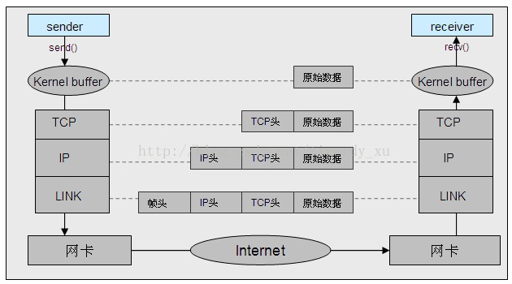
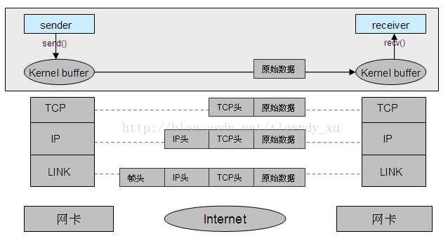

# socket通信

## AF_INET & AF_UNIX(AF_LOCAL)

### AF_INET

典型的TCP/IP四层模型的通信过程。发送方、接收方依赖IP:Port来标识，即将本地的socket绑定到对应的IP端口上，发送数据时，指定对方的IP端口，经过Internet，可以根据此IP端口最终找到接收方；接收数据时，可以从数据包中获取到发送方的IP端口。

发送方通过系统调用send()将原始数据发送到操作系统内核缓冲区中。内核缓冲区从上到下依次经过TCP层、IP层、链路层的编码，分别添加对应的头部信息，经过网卡将一个数据包发送到网络中。经过网络路由到接收方的网卡。网卡通过系统中断将数据包通知到接收方的操作系统，再沿着发送方编码的反方向进行解码，即依次经过链路层、IP层、TCP层去除头部、检查校验等，最终将原始数据上报到接收方进程。

### AF_UNIX

典型的本地IPC，类似于管道，依赖路径名标识发送方和接收方。即发送数据时，指定接收方绑定的路径名，操作系统根据该路径名可以直接找到对应的接收方，并将原始数据直接拷贝到接收方的内核缓冲区中，并上报给接收方进程进行处理。同样的接收方可以从收到的数据包中获取到发送方的路径名，并通过此路径名向其发送数据。

### 相同点
操作系统提供的接口socket(),bind(),connect(),accept(),send(),recv()，以及用来对其进行多路复用事件检测的select(),poll(),epoll()都是完全相同的。收发数据的过程中，上层应用感知不到底层的差别。

### 不同点
1. 建立socket传递的地址域，及bind()的地址结构稍有区别：

　　socket() 分别传递不同的域AF_INET和AF_UNIX

　　bind()的地址结构分别为sockaddr_in（指定IP端口）和sockaddr_un（指定路径名）

2. AF_INET需经过多个协议层的编解码，消耗系统cpu，并且数据传输需要经过网卡，受到网卡带宽的限制。AF_UNIX数据到达内核缓冲区后，由内核根据指定路径名找到接收方socket对应的内核缓冲区，直接将数据拷贝过去，不经过协议层编解码，节省系统cpu，并且不经过网卡，因此不受网卡带宽的限制。

3. AF_UNIX的传输速率远远大于AF_INET

4. AF_INET不仅可以用作本机的跨进程通信，同样的可以用于不同机器之间的通信，其就是为了在不同机器之间进行网络互联传递数据而生。而AF_UNIX则只能用于本机内进程之间的通信。

### 使用场景
AF_UNIX由于其对系统cpu的较少消耗，不受限于网卡带宽，及高效的传递速率，本机通信则首选AF_UNIX域。不用多说，AF_INET则用于跨机器之间的通信。

## recv

The receive request will complete only when one of the following events occurs:
+ The buffer supplied by the caller is completely full.
+ The connection has been closed.
+ The request has been canceled.

## send

## socket的可读可写
参考 《UNIX 网络编程卷1》中的《第6章 I/O复用》

一、 满足下列四个条件中的任何一个时，一个套接字准备好读。

+ 该套接字接收缓冲区中的数据字节数大于等于套接字接收缓存区低水位。对于TCP和UDP套接字而言，缓冲区低水位的值默认为1。那就意味着，默认情况下，只要缓冲区中有数据，那就是可读的。我们可以通过使用SO_RCVLOWAT套接字选项(参见setsockopt函数)来设置该套接字的低水位大小。此种描述符就绪(可读)的情况下，当我们使用read/recv等对该套接字执行读操作的时候，套接字不会阻塞，而是成功返回一个大于0的值（即可读数据的大小）。
+ 该连接的读半部关闭（也就是接收了FIN的TCP连接）。对这样的套接字的读操作，将不会阻塞，而是返回0（也就是EOF）。
+ 该套接字是一个listen的监听套接字，并且目前已经完成的连接数不为0。对这样的套接字进行accept操作通常不会阻塞。
+ 有一个错误套接字待处理。对这样的套接字的读操作将不阻塞并返回-1（也就是返回了一个错误），同时把errno设置成确切的错误条件。这些待处理错误(pending error)也可以通过指定SO_ERROR套接字选项调用getsockopt获取并清除。
 
二、满足下列四个条件中的任何一个时，一个套接字准备好写。

+ 该套接字发送缓冲区中的可用空间字节数大于等于套接字发送缓存区低水位标记时，并且该套接字已经成功连接（UDP套接字不需要连接）。对于TCP和UDP而言，这个低水位的值默认为2048，而套接字默认的发送缓冲区大小是8k，这就意味着一般一个套接字连接成功后，就是处于可写状态的。我们可以通过SO_SNDLOWAT套接字选项（参见setsockopt函数）来设置这个低水位。此种情况下，我们设置该套接字为非阻塞，对该套接字进行写操作(如write,send等)，将不阻塞，并返回一个正值（例如由传输层接受的字节数，即发送的数据大小）。
+ 该连接的写半部关闭(主动发送FIN包的TCP连接)。对这样的套接字的写操作将会产生SIGPIPE信号。所以我们的网络程序基本都要自定义处理SIGPIPE信号。因为SIGPIPE信号的默认处理方式是程序退出。
+ 使用非阻塞的connect套接字已建立连接，或者connect已经以失败告终。即connect有结果了。
+ 有一个错误的套接字待处理。对这样的套接字的写操作将不阻塞并返回-1（也就是返回了一个错误），同时把errno设置成确切的错误条件。这些待处理的错误也可以通过指定SO_ERROR套接字选项调用getsockopt获取并清除。

