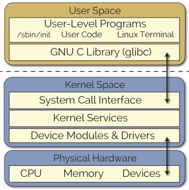
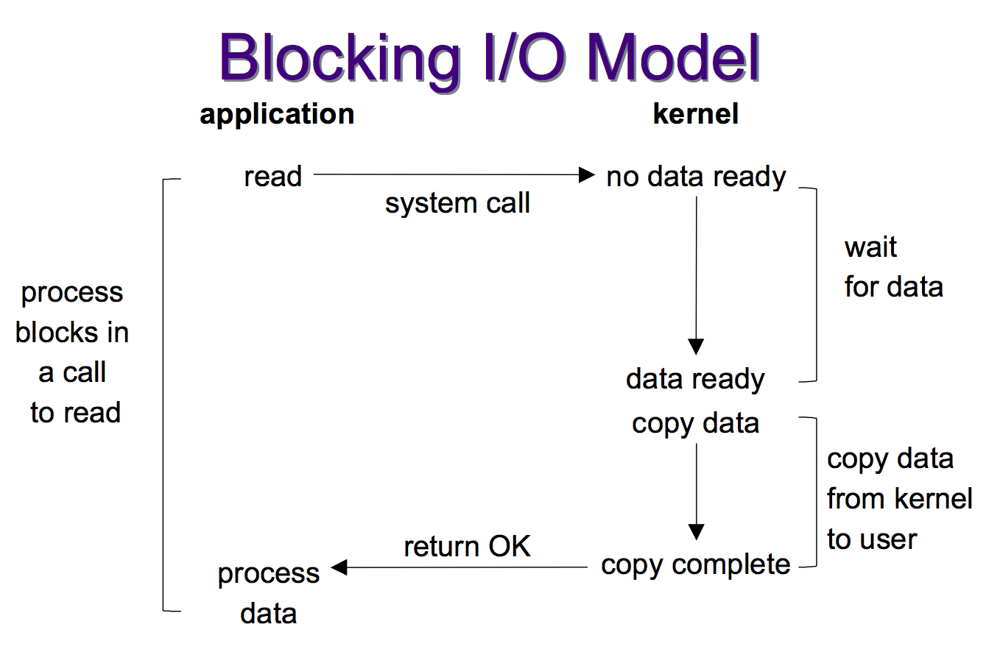
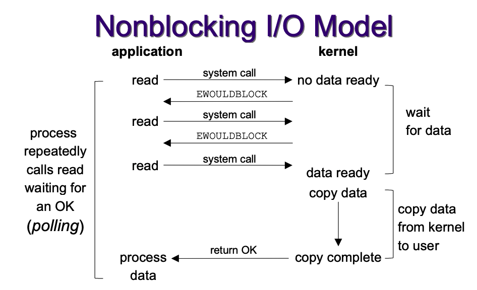
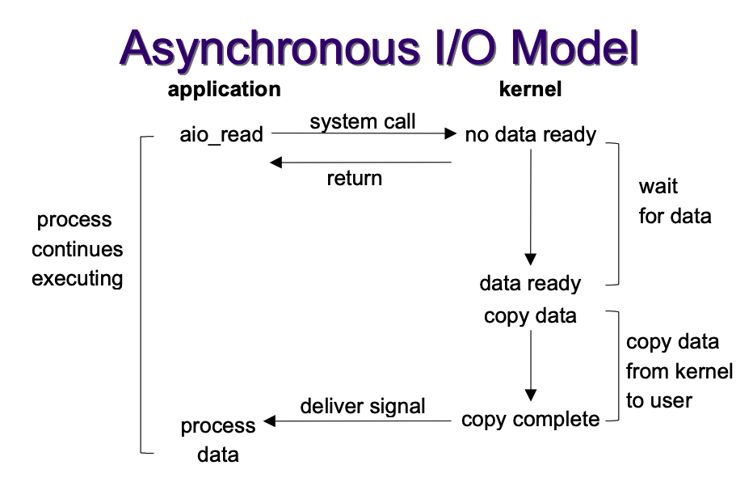
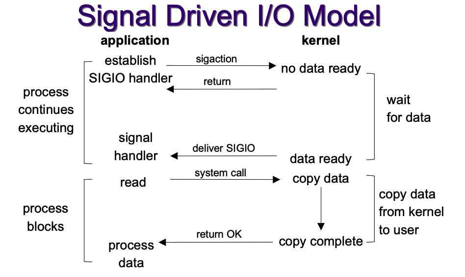
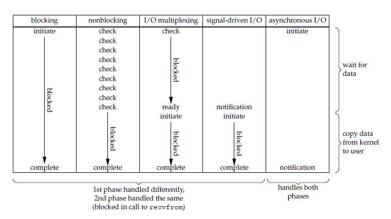

# unix io 模型

## 背景
要理解unix的io模型，就需要先理解下面的内容
+ 阻塞 I/O（blocking IO）
+ 非阻塞 I/O（nonblocking IO）
+ I/O 多路复用（ IO multiplexing）
+ 异步 I/O（asynchronous IO）
+ 信号驱动式IO模型(signal-driven IO model)

### 同步、异步、阻塞、非阻塞
请参考[同步、异步、阻塞、非阻塞](理解同步、异步、阻塞、非阻塞.md)

### 文件描述符

文件描述符（File descriptor）是计算机科学中的一个术语，是一个用于表述指向文件的引用的抽象化概念。

文件描述符在形式上是一个非负整数。实际上，它是一个索引值，指向内核为每一个进程所维护的该进程打开文件的记录表。当程序打开一个现有文件或者创建一个新文件时，内核向进程返回一个文件描述符。在程序设计中，一些涉及底层的程序编写往往会围绕着文件描述符展开。但是文件描述符这一概念往往只适用于UNIX、Linux这样的操作系统。

### 用户空间（user space）与内核空间（kernel space）
学习 Linux 时，经常可以看到两个词：User space（用户空间）和 Kernel space（内核空间）。



简单说，Kernel space 是 Linux 内核的运行空间，User space 是用户程序的运行空间。为了安全，它们是隔离的，即使用户的程序崩溃了，内核也不受影响。

Kernel space 可以执行任意命令，调用系统的一切资源；User space 只能执行简单的运算，不能直接调用系统资源，必须通过系统接口（又称 system call），才能向内核发出指令。

```
str = "my string" // 用户空间
x = x + 2 // 用户空间
file.write(str) // 切换到内核空间
y = x + 4 // 切换回用户空间
```
上面代码中，第一行和第二行都是简单的赋值运算，在 User space 执行。第三行需要写入文件，就要切换到 Kernel space，因为用户不能直接写文件，必须通过内核安排。第四行又是赋值运算，就切换回 User space。

### 进程的阻塞

正在执行的进程，由于期待的某些事件未发生，如请求系统资源失败、等待某种操作的完成、新数据尚未到达或无新工作做等，则由系统自动执行阻塞原语(Block)，使自己由运行状态变为阻塞状态。可见，进程的阻塞是进程自身的一种主动行为，也因此只有处于运行态的进程（获得CPU），才可能将其转为阻塞状态。当进程进入阻塞状态，是不占用CPU资源的。

### 进程切换

为了控制进程的执行，内核必须有能力挂起正在CPU上运行的进程，并恢复以前挂起的某个进程的执行。这种行为被称为进程切换。因此可以说，任何进程都是在操作系统内核的支持下运行的，是与内核紧密相关的。进程之间的切换其实是需要耗费cpu时间的。

### 缓存 I/O

缓存I/O又被称作标准I/O，大多数文件系统的默认I/O操作都是缓存I/O。在Linux的缓存I/O机制中，数据先从磁盘复制到内核空间的缓冲区，然后从内核空间缓冲区复制到应用程序的地址空间。

+ 读操作：操作系统检查内核的缓冲区有没有需要的数据，如果已经缓存了，那么就直接从缓存中返回；否则从磁盘中读取，然后缓存在操作系统的缓存中。
+ 写操作：将数据从用户空间复制到内核空间的缓存中。这时对用户程序来说写操作就已经完成，至于什么时候再写到磁盘中由操作系统决定，除非显示地调用了sync同步命令

缓存I/O的优点：

+ 在一定程度上分离了内核空间和用户空间，保护系统本身的运行安全；
+ 可以减少物理读盘的次数，从而提高性能。

缓存I/O的缺点：

+ 在缓存I/O机制中，DMA方式可以将数据直接从磁盘读到页缓存中，或者将数据从页缓存直接写回到磁盘上，而不能直接在应用程序地址空间和磁盘之间进行数据传输，这样，数据在传输过程中需要在应用程序地址空间（用户空间）和缓存（内核空间）之间进行多次数据拷贝操作，这些数据拷贝操作所带来的CPU以及内存开销是非常大的。

因为这个原因的存在，所以又设计到zero copy技术。

## IO模型

在linux中，对于一次IO访问（以read举例），数据会先被拷贝到操作系统内核的缓冲区中，然后才会从操作系统内核的缓冲区拷贝到应用程序的地址空间。所以说，当一个read操作发生时，它会经历两个阶段：

+ 等待数据准备就绪 (Waiting for the data to be ready)
+ 将数据从内核拷贝到进程中 (Copying the data from the kernel to the process)

正式因为这两个阶段，linux系统产生了下面五种网络模式的方案：

+ 阻塞式IO模型(blocking IO model)
+ 非阻塞式IO模型(noblocking IO model)
+ IO复用式IO模型(IO multiplexing model)
+ 信号驱动式IO模型(signal-driven IO model)
+ 异步IO式IO模型(asynchronous IO model)

### 阻塞式IO模型(blocking IO model)

在linux中，默认情况下所有的IO操作都是blocking，一个典型的读操作流程大概是这样：



当用户进程调用了recvfrom这个系统调用，kernel就开始了IO的第一个阶段：准备数据（对于网络IO来说，很多时候数据在一开始还没有到达。比如，还没有收到一个完整的UDP包。这个时候kernel就要等待足够的数据到来），而数据被拷贝到操作系统内核的缓冲区中是需要一个过程的，这个过程需要等待。而在用户进程这边，整个进程会被阻塞（当然，是进程自己选择的阻塞）。当kernel一直等到数据准备好了，它就会将数据从kernel中拷贝到用户空间的缓冲区以后，然后kernel返回结果，用户进程才解除block的状态，重新运行起来。

所以：blocking IO的特点就是在IO执行的下两个阶段的时候都被block了。

+ 等待数据准备就绪 (Waiting for the data to be ready) 「阻塞」
+ 将数据从内核拷贝到进程中 (Copying the data from the kernel to the process) 「阻塞」

### 非阻塞 I/O（nonblocking IO）
linux下，可以通过设置socket使其变为non-blocking。通过java可以这么操作：
```
InetAddress host = InetAddress.getByName("localhost");
Selector selector = Selector.open();
ServerSocketChannel serverSocketChannel = ServerSocketChannel.open();
serverSocketChannel.configureBlocking(false);
serverSocketChannel.bind(new InetSocketAddress(hos1234));
serverSocketChannel.register(selector, SelectionKey.OP_ACCEPT);
```

socket设置为 NONBLOCK（非阻塞）就是告诉内核，当所请求的I/O操作无法完成时，不要将进程睡眠，而是返回一个错误码(EWOULDBLOCK) ，这样请求就不会阻塞。

当对一个non-blocking socket执行读操作时，流程是这个样子：



当用户进程调用了recvfrom这个系统调用，如果kernel中的数据还没有准备好，那么它并不会block用户进程，而是立刻返回一个EWOULDBLOCK error。从用户进程角度讲 ，它发起一个read操作后，并不需要等待，而是马上就得到了一个结果。用户进程判断结果是一个EWOULDBLOCK error时，它就知道数据还没有准备好，于是它可以再次发送read操作。一旦kernel中的数据准备好了，并且又再次收到了用户进程的system call，那么它马上就将数据拷贝到了用户空间缓冲区，然后返回。

可以看到，I/O 操作函数将不断的测试数据是否已经准备好，如果没有准备好，继续轮询，直到数据准备好为止。整个 I/O 请求的过程中，虽然用户线程每次发起 I/O 请求后可以立即返回，但是为了等到数据，仍需要不断地轮询、重复请求，消耗了大量的 CPU 的资源。

所以，non blocking IO的特点是用户进程需要不断的主动询问kernel数据好了没有：

+ 等待数据准备就绪 (Waiting for the data to be ready) 「非阻塞」
+ 将数据从内核拷贝到进程中 (Copying the data from the kernel to the process) 「阻塞」

一般很少直接使用这种模型，而是在其他 I/O 模型中使用非阻塞 I/O 这一特性。这种方式对单个 I/O 请求意义不大,但给 I/O 多路复用铺平了道路.

### I/O 多路复用（ IO multiplexing）
IO multiplexing就是我们常说的select，poll，epoll，有些地方也称这种IO方式为event driven IO。select/epoll的好处就在于单个process就可以同时处理多个网络连接的IO。它的基本原理就是select，poll，epoll这些个function会不断的轮询所负责的所有socket，当某个socket有数据到达了，就通知用户进程。


当用户进程调用了select，那么整个进程会被block，而同时，kernel会“监视”所有select负责的socket，当任何一个socket中的数据准备好了，select就会返回。这个时候用户进程再调用read操作，将数据从kernel拷贝到用户进程。

所以，I/O 多路复用的特点是通过一种机制一个进程能同时等待多个文件描述符，而这些文件描述符（套接字描述符）其中的任意一个进入读就绪状态，select()函数就可以返回。

这个图和blocking IO的图其实并没有太大的不同，事实上因为IO多路复用多了添加监视 socket，以及调用 select 函数的额外操作，效率更差。还更差一些。因为这里需要使用两个system call (select 和 recvfrom)，而blocking IO只调用了一个system call (recvfrom)。但是，但是，使用 select 以后最大的优势是用户可以在一个线程内同时处理多个 socket 的 I/O 请求。用户可以注册多个 socket，然后不断地调用 select 读取被激活的 socket，即可达到在同一个线程内同时处理多个 I/O 请求的目的。而在同步阻塞模型中，必须通过多线程的方式才能达到这个目的。

所以，如果处理的连接数不是很高的话，使用select/epoll的web server不一定比使用multi-threading + blocking IO的web server性能更好，可能延迟还更大。select/epoll的优势并不是对于单个连接能处理得更快，而是在于能处理更多的连接。）

在IO multiplexing Model中，实际中，对于每一个socket，一般都设置成为non-blocking，但是，如上图所示，整个用户的process其实是一直被block的。只不过process是被select这个函数block，而不是被socket IO给block。

因此对于IO多路复用模型来说：

+ 等待数据准备就绪 (Waiting for the data to be ready) 「阻塞」
+ 将数据从内核拷贝到进程中 (Copying the data from the kernel to the process) 「阻塞」

### 异步 I/O（asynchronous IO）

接下来我们看看linux下的asynchronous IO的流程：


用户进程发起aio_read调用之后，立刻就可以开始去做其它的事。而另一方面，从kernel的角度，当它发现一个asynchronous read之后，首先它会立刻返回，所以不会对用户进程产生任何block。然后，kernel会等待数据准备完成，然后将数据拷贝到用户内存，当这一切都完成之后，kernel会给用户进程发送一个signal，告诉它read操作完成了。

异步 I/O 模型使用了 Proactor 设计模式实现了这一机制。

因此对异步IO模型来说：

+ 等待数据准备就绪 (Waiting for the data to be ready) 「非阻塞」
+ 将数据从内核拷贝到进程中 (Copying the data from the kernel to the process) 「非阻塞」

### 信号驱动式IO模型(signal-driven IO model)
首先我们允许 socket 进行信号驱动 I/O,并安装一个信号处理函数，进程继续运行并不阻塞。当数据准备好时，进程会收到一个SIGIO信号，可以在信号处理函数中调用 I/O 操作函数处理数据。



但是这种IO模确用的不多，所以我这里也就不详细提它了。

## 总结

blocking和non-blocking的区别:

调用blocking IO会一直block住对应的进程直到操作完成，会block2个阶段，而non-blocking IO在kernel还准备数据的情况下会立刻返回，只会block第二个阶段

synchronous IO和asynchronous IO的区别:

在说明synchronous IO和asynchronous IO的区别之前，需要先给出两者的定义。POSIX的定义是这样子的：

+ A synchronous I/O operation causes the requesting process to be blocked until that I/O operation completes;
+ An asynchronous I/O operation does not cause the requesting process to be blocked;

两者的区别就在于synchronous IO做”IO operation”的时候会将process阻塞。按照这个定义，之前所述的blocking IO，non-blocking IO，IO multiplexing都属于synchronous IO。

有人会说，non-blocking IO并没有被block啊。这里有个非常“狡猾”的地方，定义中所指的”IO operation”是指真实的IO操作，就是例子中的recvfrom这个system call。non-blocking IO在执行recvfrom这个system call的时候，如果kernel的数据没有准备好，这时候不会block进程。但是，当kernel中数据准备好的时候，recvfrom会将数据从kernel拷贝到用户内存中，这个时候进程是被block了，在这段时间内，进程是被block的。

而asynchronous IO则不一样，当进程发起IO 操作之后，就直接返回再也不理睬了，直到kernel发送一个信号，告诉进程说IO完成。在这整个过程中，进程完全没有被block。

因此我们会得出下面的分类：

+ 同步IO (synchronous IO)
    + blocking IO model
    + non-blocking IO model
    + IO multiplexing model
+ 异步IO (asynchronous IO)
    + asynchronous IO model

各个IO Model的比较:



前四种模型的区别是阶段1不相同，阶段2基本相同，都是将数据从内核拷贝到调用者的缓冲区。而异步 I/O 的两个阶段都不同于前四个模型。同步 I/O 操作引起请求进程阻塞，直到 I/O 操作完成。异步 I/O 操作不引起请求进程阻塞。

同时通过上面的图片，可以发现non-blocking IO和asynchronous IO的区别还是很明显的。在non-blocking IO中，虽然进程大部分时间都不会被block，但是它仍然要求进程去主动的check，并且当数据准备完成以后，也需要进程主动的再次调用recvfrom来将数据拷贝到用户内存。而asynchronous IO则完全不同。它就像是用户进程将整个IO操作交给了他人（kernel）完成，然后他人做完后发信号通知。在此期间，用户进程不需要去检查IO操作的状态，也不需要主动的去拷贝数据。


