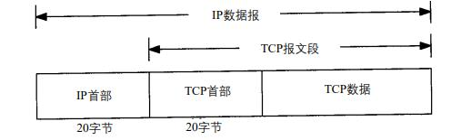
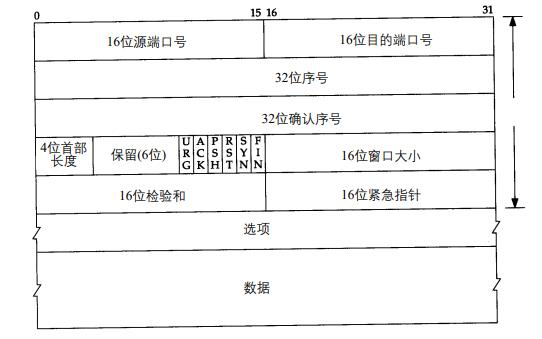
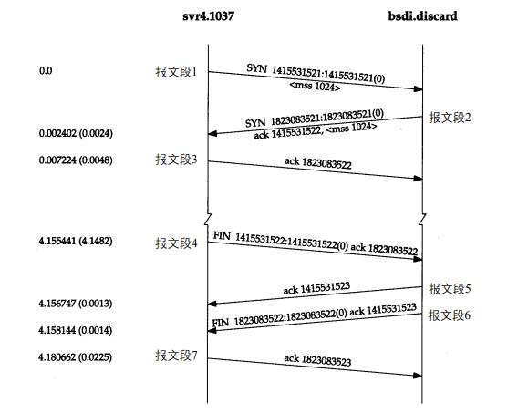
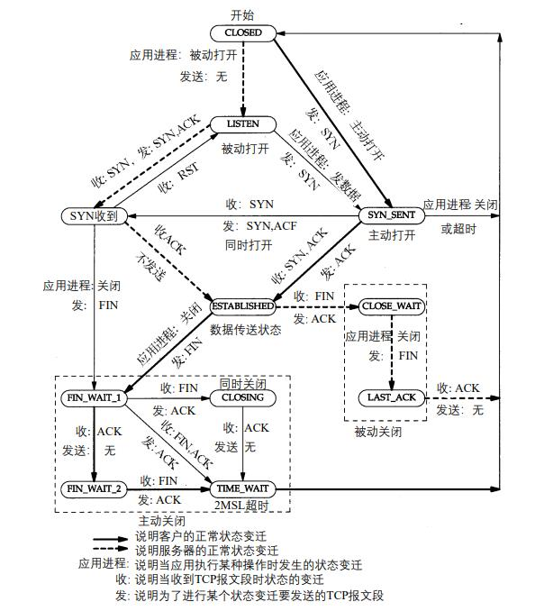
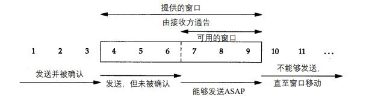

# TCP协议

## TCP数据报文

TCP数据报文被封装在IP报文中:

TCP数据报文格式：

## TCP连接建立和断开

### TCP连接建立和断开过程:

连接建立:
+ 请求端（通常称为客户）发送一个SYN指明客户打算连接的服务器的端口，以及初始序号（ISN，在这个例子中为141553521）。这个SYN段为报文段1。
+ 服务器发回包含服务器的初始序号的SYN报文段（报文段2）作为应答。同时，将确认序号设置为客户的ISN加1以对客户的SYN报文段进行确认。一个SYN将占用一个序号。
+ 客户必须将确认序号设置为服务器的ISN加1以对服务器的SYN报文段进行确认（报文段3）。
这三个报文段完成连接的建立。这个过程也称为三次握手（three-way handshake）。

连接断开:
+ 首先进行关闭的一方（即发送第一个FIN）将执行主动关闭，而另一方（收到这个FIN）执行被动关闭。
+ 当服务器收到这个FIN，它发回一个ACK，确认序号为收到的序号加1（报文段5）。和SYN一样，一个FIN将占用一个序号。
+ 同时TCP服务器还向应用程序（即丢弃服务器）传送一个文件结束符。接着这个服务器程序就关闭它的连接，导致它的TCP端发送一个FIN（报文段6）。
+ 客户必须发回一个确认，并将确认序号设置为收到序号加1（报文段7）。

建立一个连接需要三次握手，而终止一个连接要经过 4次握手。这由TCP的半关闭（half-close）造成的。既然一个TCPP连接是全双工（即数据在两个方向上能同时传递），因此每个方向必须单独地进行关闭。这原则就是当一方完成它的数据发送任务后就能发送一个FIN来终止这个方向连接。当一端收到一个FIN，它必须通知应用层另一端几经终止了那个方向的数据传送。发送FIN通常是应用层进行关闭的结果。

收到一个FIN只意味着在这一方向上没有数据流动。一个TCP连接在收到一个FIN后仍能发送数据。而这对利用半关闭的应用来说是可能的，尽管在实际应用中只有很少的TCP应用程序这样做。

### TCP状态变迁图:

### 2MSL等待状态
TIME_WAIT状态也称为2MSL等待状态。每个具体TCP实现必须选择一个报文段最大生存时间MSL（Maximum Segment Lifetime）。它是任何报文段被丢弃前在网络内的最长时间。

当TCP执行一个主动关闭，并发回最后一个ACK，该连接必须在TIME_WAIT状态停留的时间为2倍的MSL。这样可让TCP再次发送最后的ACK以防这个ACK丢失（另一端超时并重发最后的FIN）。

这种2MSL等待的另一个结果是这个TCP连接在2MSL等待期间，定义这个连接的socket（客户的IP地址和端口号，服务器的IP地址和端口号）不能再被使用。这个连接只能在2MSL结束后才能再被使用。

### 连接请求

+ 正等待连接请求的一端有一个固定长度的连接队列，该队列中的连接已被TCP接受（即三次握手已经完成），但还没有被应用层所接受。注意区分TCP接受一个连接是将其放入这个队列，而应用层接受连接是将其从该队列中移出。
+ 应用层将指明该队列的最大长度，这个值通常称为积压值(backlog)。它的取值范围是0~5之间的整数，包括0和5（大多数的应用程序都将这个值说明为5）。
+ 当一个连接请求（即SYN）到达时，TCP使用一个算法，根据当前连接队列中的连接数来确定是否接收这个连接。我们期望应用层说明的积压值为这一端点所能允许接受连接的最大数目。
+ 如果对于新的连接请求，该TCP监听的端点的连接队列中还有空间，TCP模块将对SYN进行确认并完成连接的建立。但应用层只有在三次握手中的第三个报文段收到后才会知道这个新连接时。另外，当客户进程的主动打开成功但服务器的应用层还不知道这个新的连接时，它可能会认为服务器进程已经准备好接收数据了（如果发生这种情况，服务器的 TCP仅将接收的数据放入缓冲队列 )。
+ 如果对于新的连接请求，连接队列中已没有空间， TCP将不理会收到的SYN。也不发回任何报文段（即不发回RST）。如果应用层不能及时接受已被TCP接受的连接，这些连接可能占满整个连接队列，客户的主动打开最终将超时。

## 交互数据流

交互的客户一般每次发送一个字节到服务器，这就产生了一些41字节长的分组：20字节的IP首部、20字节的TCP首部和1个字节的数据。在局域网上，这些小分组（被称为微小分组）通常不会引起麻烦，因为局域网一般不会出现拥塞。但在广域网上，这些小分组则会增加拥塞出现的可能。

### Nagle算法

该算法要求一个TCP连接上最多只能有一个未被确认的未完成的小分组，在该分组的确认到达之前不能发送其他的小分组。相反，TCP收集这些少量的分组，并在确认到来时以一个分组的方式发出去。该算法的优越之处在于它是自适应的：确认到达得越快，数据也就发送得越快。而在希望减少微小分组数目的低速广域网上，则会发送更少的分组。

## 块数据流

停止等待协议 : 数据发送方在发送下一个数据块之前需要等待接收对已发送数据的确认。

滑动窗口协议 : 允许发送方在停止并等待确认前可以连续发送多个分组。

由于发送方不必每发一个分组就停下来等待确认，因此该协议可以加速数据的传输。

### 滑动窗口

### 慢启动

发送方一开始便向网络发送多个报文段，直至达到接收方通告的窗口大小为止。当发送方和接收方处于同一个局域网时，这种方式是可以的。但是如果在发送方和接收方之间存在多个路由器和速率较慢的链路时，就有可能出现一些问题。一些中间路由器必须缓存分组，并有可能耗尽存储器的空间。 

慢启动为发送方的TCP增加了另一个窗口：拥塞窗口。当与另一个网络的主机建立TCP连接时，拥塞窗口被初始化为1个报文段（即另一端通告的报文段大小）。每收到一个ACK，拥塞窗口就增加一个报文段。发送方取拥塞窗口与通告窗口中的最小值作为发送上限。拥塞窗口是发送方使用的流量控制，而通告窗口则是接收方使用的流量控制。

## 拥塞控制

## 超时&重传

TCP提供可靠的运输层。它使用的方法之一就是确认从另一端收到的数据。但数据和确认都有可能会丢失。TCP通过在发送时设置一个定时器来解决这种问题。如果当定时器溢出时还没有收到确认，它就重传该数据。对任何实现而言，关键之处就在于超时和重传的策略，即怎样决定超时间隔和如何确定重传的频率。

对每个连接，TCP管理4个不同的定时器。
+ 重传定时器使用于当希望收到另一端的确认。在本章我们将详细讨论这个定时器以及一些相关的问题，如拥塞避免。
+ 坚持定时器使窗口大小信息保持不断流动，即使另一端关闭了其接收窗口。
+ 保活定时器可检测到一个空闲连接的另一端何时崩溃或重启。
+ 2MSL定时器测量一个连接处于TIME_WAIT状态的时间。

### 往返时间RTT

### 拥塞避免

有两种拥塞发生的指示：发生超时和接收到重复的确认。

拥塞避免算法和慢启动算法是两个目的不同、独立的算法。但是当拥塞发生时，这两个算法在一起使用。

拥塞避免算法和慢启动算法需要对每个连接维持两个变量：一个拥塞窗口和一个慢启动门限。这样得到的算法的工作过程如下：
+ 对一个给定的连接，初始化拥塞窗口为1个报文段，慢启动门限为6 5 5 3 5个字节。
+ TCP发送的数据报文不能超过拥塞窗口和接收方通告窗口的大小。拥塞窗口是发送方使用的流量控制，而通告窗口则是接收方进行的流量控制。前者是发送方感受到的网络拥塞的估计，而后者则与接收方在该连接上的可用缓存大小有关。
+ 当拥塞发生时（超时或收到重复确认），慢启动门限被设置为当前窗口大小的一半（拥塞窗口和接收方通告窗口大小的最小值，但最少为2个报文段）。此外，如果是超时引起了拥塞，则拥塞窗口被设置为1个报文段（这就是慢启动）。
+ 当新的数据被对方确认时，就增加拥塞窗口，但增加的方法依赖于我们是否正在进行慢启动或拥塞避免。如果拥塞窗口小于或等于慢启动门限，则正在进行慢启动，否则正在进行拥塞避免。
    + 慢启动一直持续到我们回到当拥塞发生时所处位置的半时候才停止（因为我们记录了在步骤2中给我们制造麻烦的窗口大小的一半），然后转为执行拥塞避免。慢启动算法初始设置拥塞窗口为1个报文段，此后每收到一个确认就加*2。那样，这会使窗口按指数方式增长：发送 1个报文段，然后是2个，接着是4个……。
    + 拥塞避免算法要求每次收到一个确认时将拥塞窗口增加1。与慢启动的指数增加比起来，这是一种加性增长。

