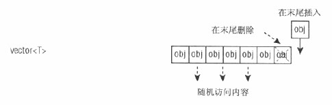
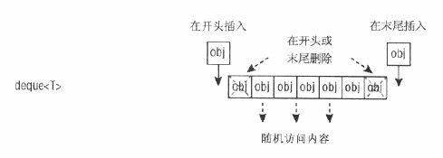

# 数据结构

## 常见的数据结构

+ 数组 go语言中的slice是一种可扩容和收缩的动态数组
    1. go语言的[slice使用](./../../golib/slice)
+ 链表 go语言容器包中的list, go语言环境下使用list比较少，更多的是使用map和slice，因为指针对go语言的垃圾回收性能影响比较大
    1. go语言容器包中的[list使用](./../../golib/list)
+ 栈
    1. go语言包中的[stack实现](https://github.com/golang-collections/collections/blob/master/stack/stack.go)
    2. 基于list的[stack实现](./../../golib/stack/stack_list.go)
    3. 基于slice的[stack实现](./../../golib/stack/stack_slice.go)
+ 队列
    1. go语言包中的[queue实现](https://github.com/golang-collections/go-datastructures/blob/master/queue/queue.go)
+ 最小堆/最大堆
    1. 使用go语言[实现的最大最小堆](./unlinear/maxminheap)
    2. go语言包中的[最大最小堆使用](./../../golib/sort/heapsort_test.go)
    3. [使用go语言包的堆排序](./../../golib/sort/heapsort_test.go)
    4. [堆排序](./../sort/memsort/comsort/selectsort/heapsort)
    5. [使用最小堆的霍夫曼编码](./../algorithms/huffmancoding)
+ 优先队列
    1. go语言包中的[priority_queue实现](https://github.com/golang-collections/go-datastructures/blob/master/queue/priority_queue.go)
    2. go语言包中的[priority_queue使用](./../../golib/sort/heappriorityqueue_test.go)
+ 平衡二叉搜索树
    + avl树
        1. go语言[实现avl](./unlinear/avl3.0)
    + rb树
        1. [STL为什么使用rb树而不是avl树](https://www.zhihu.com/question/20545708)
        2. [MIT算法导论-红黑树](https://www.bilibili.com/video/BV1Tb411M7FA?p=10)
    + 2-3树
    + 2-3-4树
    + b树
+ skiplist
    1. go语言[实现skiplist](./unlinear/skiplistv1)
    2. [redis为什么使用skiplist而不是平衡树](https://zhuanlan.zhihu.com/p/23370124)
    3. [MIT算法导论-跳跃表](https://www.bilibili.com/video/BV1Tb411M7FA?p=12)
+ hash table
    1. [MIT算法导论-哈希表](https://www.bilibili.com/video/BV1Tb411M7FA?p=7)
+ set 有使用avl和rb树实现的有序set，也有hsah table实现的无序set
+ map 有使用avl或者rb树实现的有序map，也有hash table实现的无序map

## C++的数据结构

### 序列容器
vector是动态可扩容数组，list是双向链表，而deque则在功能上合并了vector和list。

使用区别：
1. 如果你需要高效的随机存取，而不在乎插入和删除的效率，使用vector
2. 如果你需要大量的插入和删除，而不关心随即存取，则应使用list
3. 如果你需要随机存取，而且关心两端数据的插入和删除，则应使用deque

### vector
vector是封装了的数组，可以自动扩容。

在内存中分配一块连续的内存空间进行存储。支持不指定vector大小的存储。STL内部实现时，首先分配一个非常大的内存空间预备进行存储，即capacituy（）函数返回的大小，当超过此分配的空间时再整体重新放分配一块内存存储，这给人以vector可以不指定vector即一个连续内存的大小的感觉。通常此默认的内存分配能完成大部分情况下的存储。

优点：
1. 不指定一块内存大小的数组的连续存储，即可以像数组一样操作，但可以对此数组进行动态操作。通常体现在push_back() pop_back()
2. 随机访问方便，即支持[]操作符和at()
3. 节省空间。

缺点：
1. 在内部进行插入删除操作效率低
2. 只能在vector的最后进行push和pop，不能在vector的头进行push和pop
3. 当动态添加的数据超过vector默认分配的大小时要进行整体的重新分配、拷贝与释放

图解：vector<T>序列容器,可以随机访问容器的内容，在序列末尾添加或删除对象，但是因为是从尾部删除，过程非常慢，因为必须移动插入或删除点后面的所有对象。

### list
list是封装了的双向链表，在常量时间内完成增删元素，但不能索引访问。

每一个结点都包括一个信息快Info、一个前驱指针Pre、一个后驱指针Post。可以不分配必须的内存大小方便的进行添加和删除操作。使用的是非连续的内存空间进行存储。

优点：
1. 不使用连续内存完成动态操作
2. 在内部方便的进行插入和删除操作
3. 可在两端进行push、pop

缺点：
1. 不能进行内部的随机访问，即不支持[]操作符和at()
2. 相对于verctor占用内存多

图解： list<T>序列容器，以有效的在任何位置添加和删除，列表的缺点是不能随机访问内容，要想访问内容必须在列表的内部从头开始遍历内容，或者从尾部开始。

### deque
双端队列double-end queue是在功能上合并了vector和list。

优点：
1. 随机访问方便，即支持[]操作符和at()
2. 在内部方便的进行插入和删除操作
3. 可在两端进行push、pop

缺点：
1. 占用内存多

图解： deque<T>序列容器，非常类似vector<T>，且支持相同的操作，但是它还可以在序列开头添加和删除，所以就有了两个函数：push_front和pop_front。并且有两个迭代器变量。

### 关联容器
set&multiset以及map/multimap是维护动态有序数据最为常见的做法。采用平衡二叉搜索树的红黑树来实现。

unordered_set/unordered_multiset以及unordered_map/unordered_multimap是实现CURD最为常见和高效的做法。采用哈希表来实现。

两者最大的区别：
set&multiset以及map/multimap中的数据有排序，unordered_set/unordered_multiset以及unordered_map/unordered_multimap中数据无排序。

### set&multiset
set&multiset属于关联式容器。

set所包含的元素是唯一的，而multiset允许有重复的元素。

set&multiset中的元素按一定顺序排列，元素插入过程是按排序规则插入，所以不能指定插入位置。采用红黑树变体的数据结构实现，红黑树是平衡二叉搜索树，在保证数据有序的条件下插入和删除操作上比vector快。在搜素指定key时要比list快。

优点：
1. 不使用连续内存完成动态操作
2. 非常方便高效的进行插入和删除操作，且保持有序
3. 非常高效的查询操作

缺点：
1. 不能进行随机访问，即不支持[]操作符和at()
2. 维护平衡二叉搜索树较复杂
3. 不支持直接修改一个key

### map&multimap
map&multimap属于关联式容器。

map&multimap是一个键值对序列，即(key,value)对，集合中的元素按一定顺序排列，元素插入过程是按排序规则插入，所有不能指定插入位置。采用红黑树变体平衡二叉搜索树的数据结构实现，在保证数据有序的条件下插入和删除操作上比vector快。在搜素指定key时要比list快。

map可以直接存取key所对应的value，支持[]操作符，如map[key]=value。

multimap与map的区别：map支持唯一key，每个key只能出现一次；而multimap中相同key可以出现多次，multimap不支持[]操作符。

优点：
1. 不使用连续内存完成动态操作
2. 非常方便高效的进行插入和删除操作，且保持有序
3. map支持key的[]操作符，可以直接修改一个key的value

缺点：
1. 不能进行随机访问，即不支持索引的[]操作符和at()
2. 维护平衡二叉搜索树较复杂
3. 不支持直接修改一个元素的key

### unordered_set&unordered_multiset
unordered_set&unordered_multiset属于关联式容器。

unordered_set所包含的元素是唯一的，而unordered_multiset允许有重复的元素。

unordered_set/unordered_multiset中的元素插入位置是随机的且不能指定插入位置。采用哈希表实现，在插入和删除操作上比vector快，甚至比set&multiset还要快。但数据无序。

优点：
1. 不使用连续内存完成动态操作
2. 非常方便高效的进行插入和删除操作，但数据无序

缺点：
1. 不能进行随机访问，即不支持[]操作符和at()
2. 不支持直接修改一个key

### unordered_map&unordered_multimap
unordered_map&unordered_multimap属于关联式容器。

unordered_map&unordered_multimap是一个键值对序列，即(key,value)对，集合中的元素位置是随机的，且不能指定插入位置。采用哈希表实现，在插入和删除操作上比vector快，甚至比map/multimap还要快

unordered_map可以直接存取key所对应的value，支持[]操作符，如unordered_map[key]=value。

unordered_map/unordered_multimap的区别：unordered_map支持唯一key，每个key只能出现一次；而unordered_multimap中相同key可以出现多次，unordered_multimap不支持[]操作符。

优点：
1. 不使用连续内存完成动态操作
2. 非常方便高效的进行插入和删除操作，但数据无序
3. unordered_map支持key的[]操作符，可以直接修改一个key的value

缺点：
1. 不能进行随机访问，即不支持索引的[]操作符和at()
2. 不支持直接修改一个元素的key

## redis数据结构

### hash
hash对象采用ziplist或者hashtable来实现。

这种结构类似go的map和c++中的unordered_map。

当两个或者以上的key被分配到hashtable的同一个索引上时，会产生hash冲突，redis使用最常用的链地址法来解决key冲突。

hash带有两个hashtable，随着对hash的操作，key会逐渐增多或者减少，为了让hashtable的负载因子维持在一个合理范围内，redis会对hashtable的大小进行扩容或者收缩，这需要rehash，redis采用的是多次、渐进的rehash。

图解：redis hash：

### list
list对象采用ziplist或者linkedlist来实现。

redis的list支持在两端插入和弹出，可以获取指定位置或者范围的元素。

图解：redis list：

### set
set对象采用intset或者hashtable来实现。

### zset
zset对象采用ziplist或者skiplist来实现。

图解：redis skiplist:

