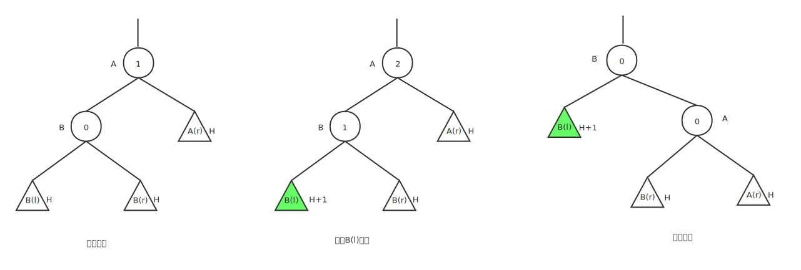
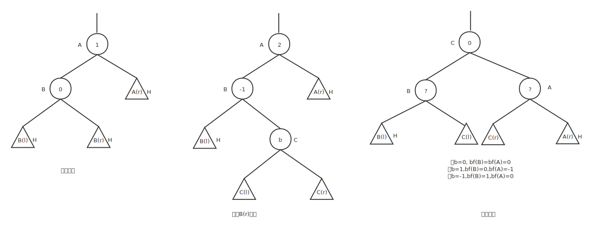
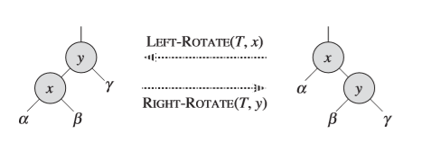

# 树

## 二叉树

二叉树(binary tree)t是有限个元素的集合，有一个称为根的元素，其余元素组成2个二叉树，分别称为t的左子树和右子树。

## 二叉搜索树

二叉搜索树(binary search tree)t满足以下特性：

（1） 每个节点有一个key，并且没有任意两个节点有相同的key，即所有节点的key都是唯一的。

（2） 根节点的左子树key小于根节点的key。

（3） 根节点的右子树key大于根节点的key。

（4） 根节点的左子树和右子树也是二叉搜索树。

BST搜索、插入和删除操作的平均时间复杂度为O(logn),最坏时间复杂度为O(n)。

## 重复key的二叉搜索树

根节点的左子树key小于等于根节点的key，根节点的右子树key大于等于根节点的key。DBST。

## 带索引的二叉搜索树

和二叉搜索树不同的是，在每个节点中添加一个leftSize域，该域值是该节点左子树的元素个数+1。IndexedBST。

## AVL树

如果T是二叉树，T(l)和T(r)是其左子树和右子树，|H(l)-H(r)|<=1且T(l)和T(r)是AVL树。

## AVL搜索树

当一个二叉树T既是AVL树同时也是搜索树时，T为AVL搜索树。
AVL搜索树的高度为O(logn),搜索、插入和删除均能在O(logn)时间内完成。
AVL树节点x的平衡因子bf(x)定义为：x的左子树高度-x的右子树高度。

在插入过程中，使得AVL平衡遭到破坏的情形是插入使得路径上节点的平衡因子bf(x)由-1变为-2，或者由1变为2，所以在插入过程中跟踪路径上最后的平衡因子为1或者-1的节点，记为A。

如果A不存在，则表明从根节点到插入新节点路劲上所有节点的平衡因子都是0，那么在插入新节点后，树平衡不会被破坏。由于插入之前从跟节点到插入新节点路劲上所有节点的平衡因子都是0，在插入新节点后，将导致整个路径上的平衡因子都需要更新，如果新插入节点在该节点的右子树上，则平衡因子修改为-1，如果在左子树上，则平衡因子为1。

如果A存在，bf(A)为1，且新插入发生在右子树上，由于右子树所有节点的平衡因子都是0，那么新插入后，高度必定加1，那么插入后bf(A)为0，A的右子树的平衡因子更新按照上面平衡因子全是0的情况更新。

如果A存在，bf(A)为-1，且新插入发生在左子树上，和上面的情况一样，是对称的场景。

如果A存在，bf(A)为1，且新插入发生在左子树上，或者bf(A)为-1，且新插入发生在右子树上，AVL的平衡性遭到破坏，A的不平衡性根据新插入节点在A的左子树中还是右子树中分为L型不平衡和R型不平衡，通过确定A的哪一个孙节点在新插入节点的路径上，可以进一步细分为LL，LR，RR，RL四种类型，RR、RL型的不平衡和LL、LR型不平衡是对称情况。

新插入节点导致的LL不平衡，LL不平衡需要进行R单旋转


新插入节点导致的LR不平衡，LR不平衡需要进行LR双旋转


在新插入节点导致不平衡后通过旋转再平衡后，A节点子树的高度前后没有变化，这样从A到根节点路径上所有节点的平衡因子前后不变。其旋转后的子树的平衡因子修改按照旋转类型进行。

LR的双旋转可以看成是L单旋转后的R单旋转。

AVL树插入操作

（1） 沿着从根节点开始的路径对具有相同key的元素进行搜索，以找到插入新元素的位置，在次过程中，记录最近的，平衡因子为-1或者1的节点，记为A节点。如果找到相同key的元素，则插入失败。

（2） 如果没有这样的节点A，从根节点开始再遍历一次，修改平衡因子，然后终止。

（3） 如果bf(A)=1并且新节点插入到A的右子树中，或者bf(A)=-1并且新节点插入到A的左子树中，那么A的平衡因子为0，修改从A到新节点路径上节点的平衡因子，然后终止。

（4） 确定A的不平衡类型并执行相应的旋转，从新子树的根节点开始至新插入节点，根据旋转需要修改节点的平衡因子。

## 二叉搜索平衡树

AVL树、红黑树(rb树),AVL树每个插入操作最多需要一次旋转，每个删除操作最多需要O(logn)次旋转，红黑树每个插入和删除操作最多需要一次旋转。

有些场景对旋转有要求，如并发的搜索需求、平衡优先搜索树。

## 平衡优先搜索树

平衡优先搜索树用于描述具有两个关键值得元素，此时，每个关键值是一对数(x,y),它同时是一个关于y的优先队列和关于x的搜索树。

## B-树

对于很大数据来说，数据需要存储在磁盘上，需要使用带有更高次数的搜索树，B-树应用于该场景中。

## 红黑树简介

### 定义

红黑树又称为RB Tree,它是一种特殊的二叉查找树，红黑树的每个节点被标记了颜色，可以是红或者黑。

红黑树满足以下特性：

（1） 每个节点是黑色或者红色

（2） 根节点是黑色

（3） 每个叶子节点是黑色

（4） 如果一个节点是红色，则它的子节点必须是黑色的

（5） 从一个节点到该节点的所有子孙节点的路径上包含相同数目的黑节点

### 简介

红黑树是一种接近平衡的二叉查找树

### 应用

C++ STL中的Set和Map均使用了红黑树作为其数据结构，有些内存分配算法也使用红黑树。

### 同类

AVL树，B树

## 红黑树操作

红黑树的基本操作是添加、删除和搜索，搜索不改变树结构，添加和删除后，树结构被改变，可能不再满足红黑树的特性，要维持为红黑树，需要用到三个子操作，左旋、右旋和变色。

我们先看三个子操作，之后再介绍其基本操作。



### 左旋

pseudo-code

```
LEFT-ROTATE(T, x)  
  y = x.right
  x.right = y.left
  if y.left != nil
    y.left.p = x
  y.p = x.p
  if x.p == nil
    T.root = y
  else if x == x.p.left
    x.p.left = y
  else
    x.p.right = y
  y.left = x
  x.p = y
```

### 右旋


pseudo-code
```
RIGHT-ROTATE(T, y)  
  x ← left[y]             // 前提：这里假设y的左孩子为x。下面开始正式操作
  left[y] ← right[x]      // 将 “x的右孩子” 设为 “y的左孩子”，即 将β设为y的左孩子
  p[right[x]] ← y         // 将 “y” 设为 “x的右孩子的父亲”，即 将β的父亲设为y
  p[x] ← p[y]             // 将 “y的父亲” 设为 “x的父亲”
  if p[y] = nil[T]       
  then root[T] ← x                 // 情况1：如果 “y的父亲” 是空节点，则将x设为根节点
  else if y = right[p[y]]  
            then right[p[y]] ← x   // 情况2：如果 y是它父节点的右孩子，则将x设为“y的父节点的左孩子”
            else left[p[y]] ← x    // 情况3：(y是它父节点的左孩子) 将x设为“y的父节点的左孩子”
  right[x] ← y            // 将 “y” 设为 “x的右孩子”
  p[y] ← x                // 将 “y的父节点” 设为 “x”
```

### 添加

pseudo-code
```
RB-INSERT(T, z)  
  y ← nil[T]                        // 新建节点“y”，将y设为空节点。
  x ← root[T]                       // 设“红黑树T”的根节点为“x”
  while x ≠ nil[T]                  // 找出要插入的节点“z”在二叉树T中的位置“y”
      do y ← x                      
         if key[z] < key[x]  
            then x ← left[x]  
            else x ← right[x]  
  p[z] ← y                          // 设置 “z的父亲” 为 “y”
  if y = nil[T]                     
     then root[T] ← z               // 情况1：若y是空节点，则将z设为根
     else if key[z] < key[y]        
             then left[y] ← z       // 情况2：若“z所包含的值” < “y所包含的值”，则将z设为“y的左孩子”
             else right[y] ← z      // 情况3：(“z所包含的值” >= “y所包含的值”)将z设为“y的右孩子” 
  left[z] ← nil[T]                  // z的左孩子设为空
  right[z] ← nil[T]                 // z的右孩子设为空。至此，已经完成将“节点z插入到二叉树”中了。
  color[z] ← RED                    // 将z着色为“红色”
  RB-INSERT-FIXUP(T, z)             // 通过RB-INSERT-FIXUP对红黑树的节点进行颜色修改以及旋转，让树T仍然是一颗红黑树
```

### 修复
pseudo-code
```
RB-INSERT-FIXUP(T, z)
 while color[p[z]] = RED                                                  // 若“当前节点(z)的父节点是红色”，则进行以下处理。
     do if p[z] = left[p[p[z]]]                                           // 若“z的父节点”是“z的祖父节点的左孩子”，则进行以下处理。
           then y ← right[p[p[z]]]                                        // 将y设置为“z的叔叔节点(z的祖父节点的右孩子)”
                if color[y] = RED                                         // Case 1条件：叔叔是红色
                   then color[p[z]] ← BLACK                    ▹ Case 1   //  (01) 将“父节点”设为黑色。
                        color[y] ← BLACK                       ▹ Case 1   //  (02) 将“叔叔节点”设为黑色。
                        color[p[p[z]]] ← RED                   ▹ Case 1   //  (03) 将“祖父节点”设为“红色”。
                        z ← p[p[z]]                            ▹ Case 1   //  (04) 将“祖父节点”设为“当前节点”(红色节点)
                   else if z = right[p[z]]                                // Case 2条件：叔叔是黑色，且当前节点是右孩子
                           then z ← p[z]                       ▹ Case 2   //  (01) 将“父节点”作为“新的当前节点”。
                                LEFT-ROTATE(T, z)              ▹ Case 2   //  (02) 以“新的当前节点”为支点进行左旋。
                           color[p[z]] ← BLACK                 ▹ Case 3   // Case 3条件：叔叔是黑色，且当前节点是左孩子。(01) 将“父节点”设为“黑色”。
                           color[p[p[z]]] ← RED                ▹ Case 3   //  (02) 将“祖父节点”设为“红色”。
                           RIGHT-ROTATE(T, p[p[z]])            ▹ Case 3   //  (03) 以“祖父节点”为支点进行右旋。
        else (same as then clause with "right" and "left" exchanged)      // 若“z的父节点”是“z的祖父节点的右孩子”，将上面的操作中“right”和“left”交换位置，然后依次执行。
 color[root[T]] ← BLACK 
```