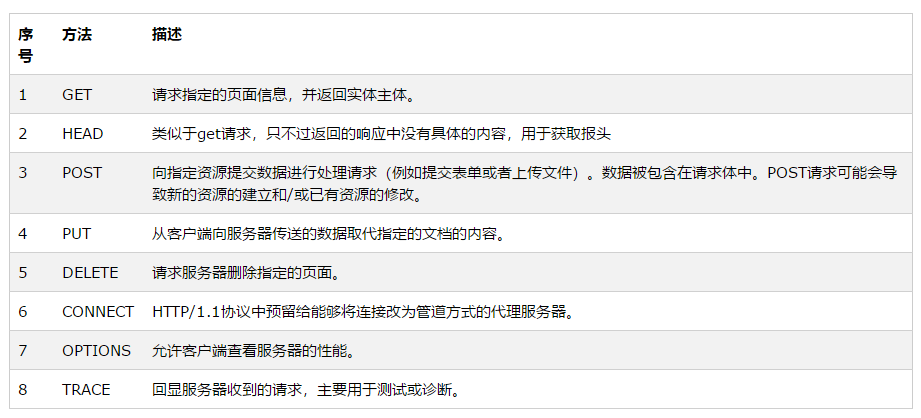

# beego使用手册

## HTTP的请求方法

+ HTTP1.0定义了三种请求方法： GET, POST 和 HEAD方法。
+ HTTP1.1新增了五种请求方法：OPTIONS, PUT, DELETE, TRACE 和 CONNECT 方法。

## beego的路由

beego存在三种方式的路由：固定路由、正则路由、自动路由。

### 固定路由

固定路由也就是全匹配路由。

### 正则路由

由URI的正则表达式匹配来决定路由。

### 自动路由

### 注解路由

